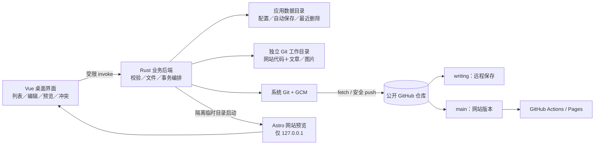

# 观澜志 Windows 本地写作软件开发方案

> **面向 AI 代理的工作者：** 实施时逐阶段拆成可独立验收的任务；使用 `subagent-driven-development` 或等效的逐任务执行方式。本文是经用户多轮确认后的产品规格、架构设计与实施计划；当前仅写方案，尚未实现或连接账号。

**目标：** 做一个仅面向 Windows 的本地桌面软件，在一个界面中管理现有观澜志的文章列表、中文 Markdown 写作、两层预览、图片、远程保存、按篇发布、撤下、删除和恢复，继续由现有 Astro 项目及 GitHub Pages 展示博客。

**架构：** 独立的本地 Git 工作目录维护网站源码；公开仓库的 `writing` 分支承载远程保存，`main` 承载已发布网站。界面只发出受限业务命令；本地后端完成安全的文件读写、Git 操作和 Astro 网站预览。按文章及其专属图片从写作快照应用到最新 `main`，绝不整体合并写作分支。

**技术栈建议：** Tauri 2 + Rust 后端、Vue 3 Composition API + TypeScript strict + Vite + pnpm 前端；Vditor 4.0.0 的源码分屏（`sv`）与即时渲染（`ir`）模式作为第一候选，原生 Git CLI + 系统 Git Credential Manager（GCM），复用仓库中的 Astro 7 与现有构建命令。具体依赖和校验和在实施时锁定、记录到锁文件；本文提到的版本是当前已核对的基线，不视作未来自动更新指令。

**范围与批准状态：** 用户已明确要求详细方案，并表示未逐项提出的设计问题采用本文推荐值；这不是安装软件、访问凭据、修改博客、创建远端分支、推送、删除远端文件或发布的授权。本次不执行这些操作。

---

## 一、现状、目标与不变量

### 1.1 已核实的现有系统

- Astro 站点定位为中文个人学习记录，近白背景、深蓝黑文字、蓝色强调；不得编造作者经历或文章。当前渲染样式由 `src/styles/global.css` 中 `.prose` 等规则控制。
- Markdown 集合来自 `src/content/blog/**/*.md`；模式要求 `title`、`description`、`pubDate`，可选 `updatedDate`，`tags` 默认空数组，`draft` 默认 `false`。文章使用普通 Markdown 和简洁 YAML front matter。来源：`src/content.config.ts:4-16`。
- 路由使用文章集合 ID：`/blog/${post.id}/`。嵌套目录也可能成为 ID 的一部分。公开文章在列表、首页、RSS、静态文章页中统一由 `publishedPosts` 排除 `draft`；`draft: true` 不公开到页面，但在公开 Git 仓库中仍可见。来源：`src/lib/posts.ts:2-6`、`src/pages/blog/[...id].astro:6-9`、`src/components/PostList.astro:18-24`、`src/pages/rss.xml.ts:10-18`。
- `origin` 指向 `guanlangzg/guanlangzg.github.io`，该 GitHub 仓库当前为公开仓库，默认分支 `main`。GitHub Actions 仅在 `main` 的 `push` 或 `workflow_dispatch` 时构建并部署 Pages，工作流位于 `.github/workflows/deploy.yml`。当前开发分支 `feat/more-sample-posts` 存在四篇未跟踪示例文章；软件首次连接不得擅自导入、同步或删除它们。
- 当前站点测试和构建脚本是 `pnpm test`、`pnpm check`、`pnpm build`，Node 下限 `22.12.0`，pnpm `10.28.2`；这些命令是在站点项目根目录运行的，不代表软件已存在相同命令。

### 1.2 经过用户确认的交互准则

1. 微信公众号编辑器如 doocs/md 只作写作体验及排版参考；博客继续统一使用观澜志样式。
2. 一个 Windows 软件内完成文章列表、写作、预览、远程保存、发布、撤下、删除与恢复。
3. 默认左右分栏，左侧 Markdown 编辑、右侧即时排版；另提供正文即时渲染模式及使用 Astro 的网站预览。
4. 本地自动保存；「同步」是明确点击的远程保存；「发布」才变更 `main`，二者始终分开。公开仓库内出现未发布草稿可以接受。
5. `writing` 是独立写作分支；网站旧版持续展示直到再次发布；每次发布只处理选中文章及其图片。
6. 远端对应文章发生变化时展示差异并暂停该文章同步，不自动覆盖。
7. 图片随文章存仓库、按文章归档；删文只清理已确认独占且没有其他引用的图片。
8. 创建时确定 URL 标识，改标题不改变 URL；改 URL 需单独操作并提示旧链接风险。
9. 软件使用独立本地工作目录，从 GitHub 建立；现有本地示例文章通过显式导入入口处理。
10. 删除文件同时作用于写作分支及 `main`；本地保留可恢复副本。恢复默认未发布，重新发布需再点击。
11. 「已提交发布」与「网站已上线」是不同状态；第一版只管理文章、元数据和文章图片。

### 1.3 强约束

- Markdown 原文是文章的唯一内容来源；编辑器中可调字体、行距、代码主题等为**本机写作偏好**，不得向文章插入专有样式指令或自动污染 front matter。网站预览严格使用 Astro 样式。
- 同步不得引起 `main` 变化；发布不得带出任何其他文章、站点代码或未选中的图片；删除不得抹去 Git 历史，也不能承诺“彻底删除”。
- 对同一文章在本地、`writing`、`main` 三处分别显示版本。版本可比较但没有全局线性「已同步即已上线」状态。
- 远端 Git 权限只用于用户指定的仓库；不得读取或回显凭据、不得把 PAT 存入前端状态、日志、配置或 Git URL；软件不内置服务器账号和云数据库。
- 主站工程现有未提交文件不受软件初始化、构建、同步影响；所有本地临时预览文件放应用专属临时目录并按受控生命周期清理。

## 二、备选方案与选型

| 路线 | 优势 | 代价与风险 | 结论 |
|---|---|---|---|
| 直接沿用 MarkText/Cherry 桌面版，再写独立 Git 发布脚本 | 日常写作很快可用；不必维护编辑器 | 不满足“同一个软件”管理三份版本、冲突和发布；产品流程割裂 | 仅作为编辑交互基准和回归样稿，不作交付架构 |
| Tauri + Vue + Vditor + 受限本地 Git 业务层 | Windows 轻量桌面壳；Vditor 官方有 `sv` 与 `ir` 两模式；Git 复用本机能力；后端可把外部读写与 UI 隔离 | 模式切换的 Markdown round-trip、粘贴中文及图片、Astro 预览成本需真实验证 | **推荐**；先做内核技术验证，未通过则更换编辑器层，保留文件/Git 设计 |
| Tauri + Vue + Cherry Markdown 内核 | 编辑、表格/图片/图表功能丰富；桌面客户端可供比较 | 与目标的两模式交互、Astro 对齐、front matter 保真仍需集成；现成客户端无法直接承接本设计的同步状态 | 作为内核备选；不复制其完整应用 |
| Tiptap/Milkdown 深度搭建 | 能高度定制组件和光标行为 | Markdown 无损往返和完整工具栏、图片工作流需要更多自行实现与维护 | 首版不采用 |

内核验收应使用当前项目真实 Markdown 样稿加专门测试夹具。检验中文输入法组合态、代码围栏、GFM 表格、链接转义、图片相对链接、front matter 隔离及模式切换保存一致性。若 Vditor 重写未知 Markdown 导致内容或文章元数据损坏，则**先保持分栏源码模式可用**，正文即时渲染模式暂停交付并以 Cherry 作替换试验；不可静默丢失原文。公众号平台特有 CSS 导出、复杂模板、直接发布公众号均不在第一版。

## 三、总体结构与信任边界



### 3.1 文件与模块边界（计划创建，不代表已存在）

建议在既有仓库新增 `apps/writer/`，不拆分或改写现有 Astro 的文章渲染；顶层 pnpm workspace 只在实际需要时新增，并保留现有站点脚本。文件单一职责如下：

```text
apps/writer/
  package.json                         # Vue/Vite/Tauri 应用命令与锁定依赖
  tsconfig.json                        # strict 模式
  index.html
  vite.config.ts
  src/
    main.ts                            # Vue 挂载
    App.vue                            # 三栏外壳、路由层布局
    components/ArticleList.vue         # 搜索/筛选/文章状态
    components/ArticleMeta.vue         # 标题、摘要、日期、标签、URL标识
    components/MarkdownEditor.vue      # Vditor 适配，正文读写和模式切换
    components/ReadingPreview.vue      # 即时排版，不冒充真实网站
    components/SyncDiff.vue            # 冲突三方差异、动作选择
    components/OperationStatus.vue     # 本地、远程、部署状态与失败处理
    components/RecentlyDeleted.vue     # 回收区
    composables/useArticle.ts          # 页面状态与编辑自动保存调度
    services/backend.ts                # 强类型 invoke 包装；无 Git/FS 直连
    types/article.ts                   # 前后端共享 JSON 协议类型镜像
    styles/tokens.css                  # 延续观澜志配色及可访问性 token
  src-tauri/
    tauri.conf.json                    # Windows 打包、窗口、CSP
    capabilities/default.json          # 仅所需 Tauri 权限
    Cargo.toml                         # Rust 精确锁定并提交 Cargo.lock
    src/main.rs                        # 应用入口
    src/lib.rs                         # 显式注册业务命令
    src/commands.rs                    # 命令参数校验、错误码映射
    src/model.rs                       # ArticleId / metadata / snapshot / error 类型
    src/article_io.rs                  # YAML front matter 无损读取与原子写盘
    src/paths.rs                       # 路径规范化、别名、图片归属校验
    src/local_store.rs                 # 偏好、崩溃恢复、本地回收副本
    src/git.rs                         # 不经 shell 的 Git 命令封装
    src/sync.rs                        # writing 分支同步和冲突检测
    src/publish.rs                     # 按篇构造 main 变更和部署跟踪
    src/trash.rs                       # 撤下／删文／恢复状态编排
    src/images.rs                      # 粘贴图片、引用检查、图片清理
    src/preview.rs                     # 隔离 Astro 预览生命周期
    tests/                              # 临时 Git 仓库集成测试夹具
```

这是一份职责清单，真正编码时只在交付阶段引入所需文件；避免先生成空模块。网站侧仅按需增加文章图片在构建期能被正确引用的路径支持、必要的 `.prose` 样式与关联测试；不更改无关页面。

### 3.2 工作目录布局与身份

- 首次连接：用户在软件界面确认目标仓库 `guanlangzg/guanlangzg.github.io`；应用目录中创建**独立 clone**。最初读取 GitHub `main`；若没有 `writing`，第一次明确点击「同步」时，以取得的远端 `main` 快照为起点建立 `writing`，并在界面预告将创建远端分支。不会操作目前开发者手头的 repo 或四篇未跟踪示例。
- 本地持久数据保存在 Windows 每用户应用数据目录，不在公开 repo 保存作者 token、编辑器本机偏好、冲突候选、回收副本或内部 JSON。软件升级只迁移此目录中的明确版本化结构；软件卸载默认不自动删除工作目录及最近删除。
- 具体存储将软件工作区、预览临时快照、用户数据分开。工作区不得在同一目录被第二个软件实例同时写入：首次实例获得排他锁，后续实例聚焦已有窗口或以只读方式报错。
- `ArticleId` 首版为在 `src/content/blog/` 下创建且之后不随标题变化的文件相对路径（不含扩展名）。创建时用用户可读的英文小写短横线标识，去重并校验 Windows 保留名、大小写冲突和 Git 路径碰撞；允许编辑已有中文文件名并保持原 URL，不强制改名。自定义改 URL 作为独立、需检查外链风险的重命名动作。
- 本地需要记录每篇文章「最近成功同步的 `writing` blob/commit」、「最近成功发布到 `main` 的 blob/commit」以及编辑会话的基线。Git 内容哈希是比较依据；本机索引可重建，不能作为远端真实状态的替代。

### 3.3 数据协议

`ArticleSummary` 仅展示 ID、标题、摘要、标签、日期、图片数及来源；`ArticleContent` 返回 raw front matter、字段、Markdown 正文和对应版本 ID；`ArticleStatus` 包含本地脏标记、远程同步状态、主站版本与 Pages 部署状态。字段类型必须显式，不用单个易误导的 `published: boolean` 概括全部情况。

```ts
type RemoteSync = 'local-only' | 'saving' | 'saved' | 'conflict' | 'failed';
type SiteState = 'never-published' | 'live-old-version' | 'publication-submitted'
  | 'deploying' | 'live-current-version' | 'deploy-failed' | 'withdrawn';
type ArticleStatus = {
  locallySaved: boolean;
  remoteSync: RemoteSync;
  site: SiteState;
  localBodyHash: string;
  writingBodyHash?: string;
  mainBodyHash?: string;
  mainCommit?: string;
  deploymentUrl?: string;
};
```

这段是前端协议示例：业务判断使用**文章文件与图像资源的完整内容哈希**，不仅比较正文哈希。未保存于前端的组合输入不可算 `locallySaved`。字段状态不必一次落盘，而由各 Git 快照和当前内存/磁盘文件推导。

### 3.4 文章格式约束

- YAML 中只向站点写已有字段。保存时保留编辑器未理解的 front matter 字段与字段顺序、原正文换行及 YAML 中合理的引号形式；受控修改字段使用解析后更新，确保二次保存不增删无关数据。语法错误不允许被“修复为默认值”后覆盖：定位错误、保留原文、阻断同步/发布。
- 新建文章默认 `draft: true`、`pubDate` 为本地选择的日历日期且在网站以 UTC 日期格式展示；标题、摘要必填；`updatedDate` 仅在用户确认更新已发布文章的元数据时由用户选择或填写，不因每次自动保存被刷新。新建仅在选择「发布」时切换主站目标文件的 `draft: false`；`writing` 中可继续保留其工作稿 `draft: true`，**不能依赖写作分支的草稿值推断网站发布状态**。
- 现有文章可能有 `draft: false`，首次导入时只记录其 `main` 状态，不自动改写到 `writing` 的 `draft`，以免新分支初始化出现海量无关差异。主站上已发布文章的远程保存应延续其原 front matter；网页仍展示旧的 `main` 版本。发布动作最终明确保证 `main` 为 `draft: false`。
- 链接、引用图片和 HTML 片段遵循现有 Astro 可处理的普通 Markdown；数学公式、Mermaid、公众号专用组件等不在首版发布格式内。编辑器可以识别并预览某些扩展，但网站预览无法验证的语法不得标称「网站支持」。

## 四、编辑与视觉设计

### 4.1 主界面

- 左侧文章列表：搜索标题/摘要/标签；筛选「全部」「仅本地」「远程已存」「网站已发布」「冲突」「最近删除」；每个条目展示三类状态的短文案，例如「本地已保存 · 远程有新稿 · 网站仍是旧版」，颜色只是辅助。
- 中间主编辑区：可调整宽度的 Markdown 源码；右侧即时排版预览。布局最小窗口宽度低于双栏可读阈值时切换“编辑/预览”选项卡，不强塞双列。文章元数据单独置于文章工具区域，正文编辑器不混写 YAML。
- 切换「正文即时渲染」时，以同一 Markdown 文本为输入；每次切换先完成中文输入法 composition、保存快照、比较来回转换结果。未知节点无损回写无法保证时发出明确提示并回退源码，不覆盖最后可恢复的原始 Markdown。
- 右侧即时预览可调字体大小、行距和代码主题，放在本机的「写作外观」面板中，**不改文章 Markdown 或网站 CSS**。另开「网站预览」显示真实 Astro 页面，标题/摘要/日期/标签和文章都按现有页面呈现。预览有「草稿模拟公开」提示，不能误认为已上线。
- 顶部操作保持明显分离：「本地保存状态」「同步到写作分支」「发布到网站」「从网站撤下」「删除文件」。发布与删除展示具体目标分支及文章清单。回收区独立于普通列表，恢复后先本地可编辑且 `draft: true`，用户再手动同步和发布。
- 沿用站点的近白底、深蓝黑文字和蓝色强调，正文阅读空间优先。UI 指南搜索返回的暖黄、琥珀色方案与现有站点不符，不采用。至少 4.5:1 的文本对比、可见焦点、正确标签、完整键盘导航；危险操作按钮有文字及图标，不只靠颜色。视觉紧凑但保留 44px 级可点击区和状态即时反馈。

### 4.2 快捷键、输入与可靠性

- `Ctrl+S` 执行本地保存而非 Git 同步；`Ctrl+Shift+S` 先打开同步确认，`Ctrl+P` 仅打开预览（不发布）；发布和删除不绑定容易误触的单键快捷键。未设快捷键的操作以可见按钮为准。
- 自动保存采用停顿防抖（建议 500–1000ms，可实现时经使用测试调整），切换文章、失焦或关闭窗口时强制 flush；原子临时文件写入后替换，并维护上一成功版本。磁盘空间不足、权限失败时显示「尚未保存到磁盘」，不显示误导性的绿色成功。
- 编辑模式切换、撤销重做、中文 IME、粘贴代码块/图片、拖入图片、撤销删除元数据字段分别验收；输入时不触发远端 Git。图片尚未复制完成前不允许远程同步。

## 五、分支同步与发布协议

### 5.1 分支及受管路径

- `writing`：远程保存当前工作稿；允许公开草稿。`main`：现有 Astro 网站唯一发布源。日常代码开发分支仍由开发者单独管理。
- 软件受管根路径仅 `src/content/blog/**/*.md` 和规划的文章专属图片目录 `public/blog/<article-id>/`。例如图片实际文件 `public/blog/read-code/figure-01.png`，Markdown 中引用 `/blog/read-code/figure-01.png`；构建时 Astro 直接从 public 输出。既有文章中的远程图片、其他目录图片和站点 logo 不自动搬运或删除。
- 图片文件名按可读基本名加短内容哈希规避同名覆盖；只支持经检测确认的 PNG、JPEG、WebP、GIF，设置大小上限（建议单张 10 MiB，超限清晰报错），忽略伪装扩展名和不可信 SVG/HTML。只复制到该文章目录，写 Markdown 相对或站点根路径；改 URL 标识时修改文章图片目录及文中对应引用，外部文章引用先检索并警告。

### 5.2 版本、冲突与离线

- 每次操作先完成本地自动保存，再读取当前工作树及远端 `writing`、`main` 头。比较**本地编辑起点**与最新远端的文章内容和所引用图片；远端变化且本地也变化，则暂停该文章，保留两边原件，展示逐行差异。图片二进制冲突展示文件名、大小、内容哈希与各自版本预览；不假称可以文本合并。
- 冲突界面支持「采用本地」「采用远端」「手工合并后保存」。选择仅影响这篇文章和对应图片；采用本地仍需**显式确认**覆盖的确切路径与远端版本，下一次 push 前再核头；采用远端时把尚未保存的本地修改先放入恢复副本。其它文章可以继续编辑/同步，不用全局冻结。
- `git fetch` 后若非快进、预期远端头变化或推送被拒绝：重新读取远端、比较基线并进入冲突流程，不自动 `--force`、不静默 merge/rebase 用户文章；网络断开则本地保存可用，待手动重试。登录过期或权限不足只显示操作性错误，不记录凭据。Git 保留完整历史用于审计和恢复，但不替代本地回收区。

### 5.3 明确的同步步骤

1. UI 刷盘并列出该文章 Markdown 和当前引用的所属图片；把对应操作入同一工作目录**串行任务队列**，禁止与同篇发布/删除并发。
2. Rust 校验仓库来源 URL、分支名称、路径白名单、Git 状态；禁止把仓库其它用户改动顺手 stage。获取 `origin/writing` 最新头并按基线检测冲突。若 `writing` 因别的文章在其他设备推进、但当前文章未变，则在新远端头之上重新构造本次仅这一篇的提交并快进推送；仅这篇或其图片真实冲突时展示差异，避免把无关文章的更新误报成冲突。
3. 在隔离索引或受控 worktree 中构造只含当前文章、图片的 Git commit；不能用无路径约束的 `git add .`。保留当前工作副本和未选中文件的变更。
4. 普通快进 push 到 `writing`。push 完后以远端 ref/commit 核实结果，更新文章的远程已保存版本；失败则不标成功，保留本地变更与可重试信息。首次创建 `writing` 时以远端最新 `main` 作为起点，创建前检查有无同名远端分支。
5. 点击“同步”永不修改 `main`；即使文章在 `writing` 的 front matter 中 `draft: false`，网站也仍由原 `main` 文件决定。

### 5.4 按篇发布步骤

1. 选中一篇文章，先完成本地保存。若本地版本尚未同步，先告知并由软件执行该篇同步；没有成功保存到 `writing` 不进入发布。读取 `main` 最新头及该篇上次发布基线，远端主站文件被外部修改也要单独冲突提示。
2. 准备候选：从**已验证的写作快照**提取该篇 Markdown 和引用图片，主站文章设 `draft: false`，保持 URL 标识与其他 front matter；对于已发布文章编辑期间，`main` 旧文件不改，直到确认发布。
3. 在最新 `main` 的隔离 worktree/临时索引上覆盖**仅该文章路径及其新增、变更、已验证不再引用的专属图片**；检查 `git diff --name-only` 全部处于允许清单。不要合并整条 `writing`，不要随手 cherry-pick 含多篇文章的同步提交。
4. 在隔离预览工作树运行 `pnpm test`、`pnpm check`、`pnpm build`，并对新文章验证页面生成、图片有输出、旧文章仍可访问、草稿没有出现在列表/RSS。校验后再在最新 `main` 上构造包含这篇文章及附件的一次 commit；若其间主分支移动，重新验证和构造；**不要把已经验证过的旧树强推到远端**。
5. 普通推送到 `main` 成功后显示「已提交发布」。按该 commit SHA 查询对应工作流运行及部署结果；仅 Pages 构建/部署成功显示「网站已上线」。读取公开仓库的工作流状态可先尝试无需凭据的只读 API，遇到限额/权限限制时使用系统凭据的受限只读方式；不把整个认证 token 暴露给渲染进程。工作流成功是服务器侧部署确认，不等于每个 CDN 节点瞬时可见；如果尚无法核实工作流或 Pages 部署结论，则显示「部署状态待确认」并提供运行链接，不凭推送成功、单次 HTTP 200 或旧网页内容猜测上线。失败则保留 `main` 已提交事实，显示构建/部署错误链接，提供修复/重试入口；不要假称可把已推送的提交原子回滚。
6. 未选中的草稿和图片不得进入上述差异；主站仍展示选中文章上次成功部署的版本，直到新部署完成。网站版本以部署对应 SHA 为准，避免“`main` 已更新但线上仍旧版”时状态自相矛盾。

**注意：** 若直接从本机经 Git 推送 `main`，现有 `push` 工作流会触发；如果未来改为在 GitHub Actions 内以它自身 `GITHUB_TOKEN` 推送文章，普通 push 不会递归触发另一个 workflow，这种设计需要单独触发 `workflow_dispatch`，不纳入首版。

### 5.5 撤下、删除、恢复与事务失败

| 操作 | 本地 | writing | main | 网站结果 |
|---|---|---|---|---|
| 撤下 | 正文与图片保留、标记非公开 | 保存最近草稿 | 将该篇设 `draft: true` 或只对主站该篇删除公开路由；推荐主站保留草稿文件以方便再发布 | 部署成功后从路由、列表、RSS 消失；仓库仍公开可读 |
| 删除文件 | 先备份正文、图片、元数据和来源版本 | 提交删除该篇和安全确认的独占图片 | 提交删除该篇与安全确认的独占图片 | 部署成功后消失；历史仍可恢复 |
| 恢复 | 从回收区还原为可编辑的本地未发布稿；解决 ID 冲突 | 仅用户再次点击同步才写入 | 不自动恢复 | 需要明确再次点击发布 |

- 「删除文件」在界面展示将删除的具体 Markdown 路径、各分支影响和图片候选；删除前先确认备份成功、磁盘足够且快照可读。逐篇扫描**主站和写作分支全部受管 Markdown**的引用，并核验独占目录；任何不确定或动态引用的图片默认留下，不把整目录递归删除。
- Git 的两个分支没有跨分支原子事务。执行前记录带操作 ID 的本地意向与原头；先完成 `writing` 删除，再完成 `main` 删除，任何一步失败都保留回收副本并显示精确状态，例如「写作分支已删／网站仍在」。重试时读取最新远端头、确认已完成步骤并补剩余操作，**不可把只完成一半显示成删除成功**。如网站不能完成删除，提供针对已执行分支的明确“恢复远端副本”操作；补偿本身同样受版本检测约束。
- 撤下是针对发布状态的单独显式操作，主站 `draft: true` 有构建过滤且可反向发布；写作分支不因撤下自动丢掉正在编辑的新稿。恢复从本地回收区生成 `draft: true` 的新工作稿并检查当前同路径远端是否已被他人占用，不能无条件覆盖。
- 删除与撤下都不是 Git 历史清除，不提供“彻底抹除所有历史”的按钮；图片清理仅清理当前分支树中安全确认的资源。

### 5.6 改 URL 标识

- 仅通过独立命令操作，显示旧/新网站 URL 与可能断裂的外链；先检查两个分支和本地是否已有目标路径（Windows 不区分大小写的冲突也须挡住）。
- 对未发布文章，仅重命名本地和后续 `writing` 文件；对已发布文章，重命名被视为一次需用户明确确认的再发布，在构建验证后对主站移除旧文件、新建新文件，并对所有站内指向旧链接的引用做扫描报告。第一版不自动实现复杂的旧 URL 跳转：用户确认可能失效后才能提交；若希望保留旧 URL，将其作为后续单独的站点重定向任务。

## 六、网站预览与格式一致性

### 6.1 两层预览

- **即时排版：** 在编辑窗口边写边渲染正文，使用与博客接近的颜色、字体、行距、代码块间距；不宣称与 Astro 输出逐像素相同。默认使用 Vditor `sv` 自带的编辑/预览双栏，不再额外创建第二个会导致视觉与滚动状态重复的预览引擎；`ReadingPreview.vue` 仅承载预览容器和主题配置。此层低延迟、离线可用，随编辑更新。
- **网站预览：** 基于最新可获取 `main` 的隔离临时工作树，覆盖当前文章尚未发布的 Markdown 与图片，必要时将 `draft` 在**临时副本**转为可预览状态；以现有 Astro 构建或仅绑定 `127.0.0.1` 的开发服务展示该文章，且不修改正式仓库、不推送、不冒充线上网址。窗口在预览页面显著显示「本地预览 · 尚未发布」。
- **预览运行条件：** 完整网站预览需要能运行此站点的 Node `>=22.12.0`、pnpm `10.28.2`、可用的已锁定项目依赖和本地 Git。Tauri 安装包本身不会自动包含这些开发工具，因此首版采用启动时能力检查及引导安装：缺少任一条件时，文章编辑和即时排版仍可用，网站预览显示明确缺项；在宣称“完整功能的 Windows 安装包”之前，必须在干净 Windows 环境安装这些前置条件并跑通。若以后要求无需额外安装即可运行网站预览，再单独评估将经过许可检查的固定版本 Node/pnpm 与构建依赖打包进安装器；不得让 UI 把缺少运行时伪装成预览成功。
- 临时构建要复用仓库锁文件，依赖不可用时显示需安装依赖的状态并让即时预览继续工作；长篇预览尽可能复用进程和依赖目录，节流触发，不为每一次敲键盘完整构建。网站预览服务退出后清理应用创建的临时工作树，不触及用户原有 `node_modules`、缓存及四篇未跟踪文章。
- 若网站环境引用 Google Fonts，离线时字体可能回退到现有 CSS 的系统字体，明确提示联网视觉差异；站点是否支持表格、Mermaid、公式等最终以 Astro 构建和实际渲染测试为准，缺失能力先限制编辑器承诺，再按需要单独完善网站样式。

### 6.2 网站端最小改动

- 图片放 `public/blog/<article-id>/` 可沿用 Astro 静态资源，无需外部图床；博客 `.prose img` 已有基础样式。
- 发布首批带表格、长代码、超长链接及图片说明的文章前检查并按需求补 `.prose` 表格滚动、移动端水平溢出和 figcaption；不得为了匹配编辑器主题将每篇文章注入内联 CSS。
- `draft: true` 已过滤首页、列表、RSS 与文章路径；集成测试要覆盖这些现有机制，避免新增预览入口误暴露草稿到线上。

## 七、安全、隐私与授权

1. **GitHub 认证：** 优先现有 Windows Git Credential Manager 通过系统浏览器登录与系统凭据存储；避免要求用户复制广权限 classic PAT。若 GCM 在目标机器不可用，应先提示安装/配置，作为兼容降级才提供限定指定仓库、`Contents: write` 且设置有效期的 fine-grained PAT，并仅交给系统安全凭据存储，不进软件配置/URL/日志。软件无对外 Web 登录回调端点。
2. **信任边界：** Tauri webview 只能调用注册的文章业务命令，不开放任意 shell、任意文件系统读写或任意 Git 命令。Rust 命令接收强类型参数、验证仓库固定身份与路径白名单；使用 `Command` 参数数组执行固定 `git`、`pnpm` 命令，不经过 `cmd /c` 字符串拼接。
3. **路径与图片：** 正规化路径并校验属于受管目录，拒绝 `..`、绝对路径、设备名、符号链接/联接点跳出、大小写冲突；导入前校验图片真实文件头、扩展名和大小。不会为本机内部数据赋予公开仓库写入权限。
4. **预览隔离：** 不可信 Markdown/内嵌 HTML 在编辑预览内消毒；远程引用有风险时阻止在具有本地命令权限的 webview 中直接执行第三方脚本。网站预览用独立 webview 或外部默认浏览器打开，仅允许本地 `127.0.0.1` 随机端口；预览服务无写操作 API，防止本机其他网页跨站发请求触发发布/删除；预览 HTML 不获得 Tauri invoke 权限。
5. **远端权限：** 客户端对指定公开仓库可获得内容写权限，但内部功能仍只允许文章/图片路径的更改；绝不让用户输入任意仓库路径变成 Git 命令。发布操作展示目标仓库、分支、受影响文件和网站版本，外部 push 的实际权限仍以 GitHub 账号为准。
6. **日志与诊断：** 记录操作 ID、路径类别、commit SHA、非敏感错误码；隐藏 token、认证响应、完整图片元数据中的私密路径及文章内容。预览临时目录和软件配置不进入 Git。外部网页、仓库 Markdown 的任何“指令文本”都只按文章内容处理，不作为软件动作。
7. **分发：** 首版先通过本地 Windows 构建安装包验收；面向其他机器分发时再设置签名和更新机制。不要在未有发布流程和供应链校验时设计自动更新或静默提权。

## 八、测试策略和可验收场景

### 8.1 自动化

- **Rust 单元测试：** front matter 未知字段保真、日期边界、URL 标识/Windows 保留名、路径穿越、图片专属引用统计、状态推导、同步/发布差异白名单、冲突选择后重新核头。
- **临时 Git 集成测试：** 在每个测试中生成隔离的本地 bare remote 与工作副本（绝不连接真实 GitHub）；模拟 `main`/`writing` 各自前进、push 拒绝、断网等。检验同步从不触碰 `main`，选中 A 发布不带出 B，删除两分支一成一败后重试，恢复不发布，图片被两篇引用时不删除，外部改动产生冲突，永不执行 force push。
- **UI/端到端测试：** Windows WebView2 中文输入法组合态、表格/代码/长文粘贴、文章切换自动保存、键盘焦点、双栏/即时渲染往返、关闭后重启恢复、预览窗口与危险操作确认。对视觉差异使用明确的长文、手机宽度和桌面宽度夹具检查，不用会泄露真实用户文章的截图。
- **真实网站集成：** 在隔离测试仓库和本机 Astro 实例中执行 `pnpm test`、`pnpm check`、`pnpm build`，并断言文章 URL、首页/列表/RSS 的草稿过滤、图片路径、移动端长代码和表格不溢出。真实 GitHub Pages 仅在准备发布测试环境且获得对应授权时端到端验证，不能从模拟测试声称线上已验证。

### 8.2 验收用例

| 编号 | 操作 | 必须观察到的结果 |
|---|---|---|
| A1 | 新建文章、写几段、断网关闭并重开 | 本地正文和元数据恢复；GitHub 两分支没有新提交 |
| A2 | 点击同步草稿 | `writing` 有这篇 Markdown/图片；`main` 和线上不变 |
| A3 | 同步已发布文章的新稿 | 网站继续展示上次 `main` 部署版本；软件显示“网站仍是旧版” |
| A4 | 另处修改同篇远端后再同步 | 差异界面出现、本地未丢失、不覆盖远端；其他文章可继续工作 |
| A5 | 写作分支有 A、B 草稿，发布 A | `main` 只包含 A 的变动和其附件；B 仍未发布；本站构建通过 |
| A6 | 构建或部署失败 | 显示已提交到 `main`、但网站未上线，并提供对应运行记录 |
| A7 | 撤下 A、同步并部署 | A 从站点、首页/列表、RSS 消失，但写作稿还在 |
| A8 | 删除 A，第二分支推送失败 | 回收副本可恢复；界面准确展示已删/未删分支；重试不重删或误删 B |
| A9 | A、B 引用同图，删除 A | 被 B 引用的图在当前所有涉及分支保留；专属无引用图可清理 |
| A10 | 从最近删除恢复 A | 本地为未发布草稿；不立即重现于 `main` 或网站 |
| A11 | 改标题及单独改 URL | 改标题不动 URL；URL 改动显示旧链接影响并只在确认后提交 |
| A12 | 导入当前开发目录四篇未提交示例 | 只有明确逐篇导入的文件进入软件工作区；项目原文件、Git 状态不变 |

## 九、阶段交付与实施任务

以下是逐阶段可验证的工作包；实施时应在隔离开发分支/工作区逐包执行、测试、审查。当前未获提交或推送授权，因此步骤中的“提交”指软件将来的功能，不指这份方案现在要在真实 GitHub 上运行。

### 阶段 0：选型技术门槛与基线

- [ ] 在隔离测试夹具中用 Vditor v4 的 `sv` 与 `ir` 往返测试文章正文、中文 IME、代码围栏、表格、图片链接；front matter 始终由后端独立维护。记录会被规范化的 Markdown 差异，确定“可接受变化”与“阻断模式切换”的规则。
- [ ] 确认 Windows Git/GCM、Rust MSVC、WebView2、Node/pnpm 开发前置条件；验证 Tauri 2 项目可启动但不连接真实仓库。选择 Vditor 未通过则测试 Cherry；唯一允许替换的是编辑适配层。
- [ ] 制作独立测试 Git 仓库（A 已发布、B 草稿、图片共享、分支并发），严禁用真实公开仓库做失败测试。记录基线 `pnpm test`、`pnpm check`、`pnpm build` 的实际结果。
- **验收：** 可展示两种编辑模式不丢失合法 Markdown，测试仓库可重现多分支状态；真实仓库与现有未提交文件无变化。

### 阶段 1：文章浏览、本地保存与编辑

- [ ] 创建 Tauri/Vue 应用最小入口、严格 TS、受限 capability。实现从固定仓库 clone 到独立目录、只读扫描文章和 front matter，并明确“从本地导入”的选择 UI。
- [ ] 实现文章 CRUD 的**本地阶段**：新建、固定 URL ID、编辑元数据、自动保存、错误提示、崩溃恢复和本机最近删除原型；此阶段按钮不得伪装已提供远端同步。
- [ ] 集成 Vditor 分栏和即时渲染模式，连同纯 Markdown 身份、撤销和中文输入测试；右侧即时排版采用本机偏好。
- [ ] `cargo test`、`pnpm` 侧类型检查/界面测试及 Windows 手工 IME 测试，覆盖 A1、A11、A12。
- **验收：** 不联网可长期写作、重启不丢稿，默认双栏和模式切换稳定，现有 Astro 站点无行为变化。

### 阶段 2：图片、网站预览与格式护栏

- [ ] 增加剪贴板/文件插图，归档至 `public/blog/<article-id>/` 并更新 Markdown 引用；验证文件头、大小、名称和引用关系。
- [ ] 建立仅本地隔离 Astro 网站预览，排除原 repo 未提交文件污染；预览文章头部、正文、图片，并显示“尚未发布”。
- [ ] 如图片、表格等在本站确有展示问题，只改相关 `.prose` CSS 与必要测试；跑站点 `pnpm test`、`pnpm check`、`pnpm build`，检查不同宽度阅读。
- **验收：** 同一篇未发布文章能看到即时与真实网站两层预览；网站临时构建结束无 Git 工作区变化。

### 阶段 3：远程保存与冲突

- [ ] Rust 后端实现受限 Git、系统 GCM 认证、`writing` 初始化、按篇变更白名单及串行队列；先用临时 bare remote 测 A2/A3/A4，再在用户指定测试仓库验证。
- [ ] 构建本地/远端基线比较、文本差异及图片冲突界面；本地/远端/手工合并都有保底副本，push 拒绝后重新读取版本。
- [ ] 检查离线、凭据失效、异常退出与二次实例同时写入；界面准确区分“本地已存”与“远程已存”。
- **验收：** 手动同步只改变 `writing` 且不会覆盖外部改动；失败时数据、重试入口和错误状态明确。

### 阶段 4：按篇发布、撤下与部署跟踪

- [ ] 从指定写作快照提取单篇与图片，验证最新 `main` 基线；隔离候选工作树构建、diff 白名单和网站路由断言，普通 push 后查询 Pages 工作流/部署结果。
- [ ] 实现“旧版继续在线”、发布中/已提交/已上线/部署失败状态；撤下仅改变该篇 `main` 的公开标志，写作稿保留。
- [ ] 在测试 Git 远端演练 A5/A6/A7；针对构建失败、主站外部改动、push 前分支变化写集成测试和明确补救流程。
- **验收：** 用户选 A 发布不会带出 B；部署失败绝不显示上线；旧网站版本在明确再发布前保持不变。

### 阶段 5：删除、恢复、URL 改名及安装包

- [ ] 实现多分支删除操作日志、删除前本地完整备份、独占图片检查、部分成功的可恢复重试；实现撤下与删文不同文案。
- [ ] 最近删除恢复为未发布稿；URL 标识重命名对旧路由、图片和文章引用做扫描与确认。
- [ ] 跑 A8–A12，追加键盘导航/可见焦点/错误消息验收；构建 Windows 安装包，在全新用户数据目录离线试运行和异常关闭恢复测试。
- [ ] 发布交付前重新执行站点 `pnpm test`、`pnpm check`、`pnpm build`，软件 Rust 与前端完整测试及手工 Windows 冒烟；记录真实已验证项目与剩余限制。
- **验收：** 删除两分支有可观察状态且可恢复；任何失败都不丢本地副本；安装包在满足明确列出的 Git/GCM、Node、pnpm 前置条件的干净 Windows 环境可启动、写作、预览、同步与按篇发布。

### 阶段 6：非首版，只有真实需要时启动

多设备自动同步、GitHub App/组织授权、公众号一键复制与平台稿、多平台安装、富文本协作、数学公式/Mermaid 的站点双端一致、图片外部图床、自动更新、旧 URL 重定向、Git 历史彻底清除均不属于首版。不为这些预先建立复杂抽象。若真实使用发现需要，先从现有协议和测试评估迁移成本。

## 十、实施顺序、风险与判定

- **最大产品风险：** `sv` ↔ `ir` 往返改变 Markdown 的格式/语义；技术门槛阶段必须证明不丢内容，失败时先交付源码分栏、再换内核。
- **最大数据风险：** 两个远端分支和本地版本交错，尤其删除不具原子性；必须使用版本基线、隔离操作、文件路径白名单、前置备份和可重试的部分成功状态。
- **最大展示风险：** 编辑器预览与 Astro 网站不同；用“即时排版 / Astro 网站预览”的清晰标签，网站预览及构建才是发布前的最后判据。
- **最大体验风险：** 发布流程频繁构建或长时间卡 UI；后台任务可取消**本地预览**，远端推送过程不能假装取消已发生的提交；状态始终显示阶段和可操作错误。完整网站预览与构建依赖目标 Windows 机器具备 Git/GCM、Node、pnpm 等外部工具；首版提供能力检查和安装指引，并在干净系统验收，不宣传成完全零前置依赖的便携软件。
- **工程可维护性：** 一期只管理站点已有 Markdown schema 和普通语法；新增 Git/文件/预览副作用留在 Rust 边界，Vue 管交互，Astro 管网站显示，三个层次有可独立运行的测试。

## 十一、官方资料与核验边界

- Astro 内容集合与 glob ID：[Content collections](https://docs.astro.build/en/guides/content-collections/)；本站具体字段以 `src/content.config.ts` 为准。
- GitHub 内容 API 单文件 SHA 条件及删除：[Repository contents](https://docs.github.com/en/rest/repos/contents)。本方案选择本地 Git CLI，以便正文和多张图片打包成一次提交并复用 Windows GCM，而不是把多个单文件 API 请求当作一次原子发布。
- GitHub 权限与 GCM：[Managing personal access tokens](https://docs.github.com/en/authentication/keeping-your-account-and-data-secure/managing-your-personal-access-tokens)。
- 工作流运行状态：[Workflow runs API](https://docs.github.com/en/rest/actions/workflow-runs)；Pages：[custom workflows](https://docs.github.com/en/pages/getting-started-with-github-pages/using-custom-workflows-with-github-pages)；`GITHUB_TOKEN` 工作流事件例外：[Triggering a workflow](https://docs.github.com/en/actions/how-tos/write-workflows/choose-when-workflows-run/trigger-a-workflow)。
- 删除仍留 Git 历史：[Deleting files in a repository](https://docs.github.com/en/repositories/working-with-files/managing-files/deleting-files-in-a-repository)。
- Tauri Windows 前置条件：[Prerequisites](https://v2.tauri.app/start/prerequisites/)；受限能力：[Capabilities](https://v2.tauri.app/security/capabilities/)；受限命令：[Calling Rust from frontend](https://v2.tauri.app/develop/calling-rust/)。
- 编辑器候选：[Vditor](https://github.com/Vanessa219/vditor)、[Vditor 三模式演示](https://b3log.org/vditor/demo/option-mode.html)、[Cherry Markdown](https://github.com/Tencent/cherry-markdown)、[doocs/md](https://github.com/doocs/md)。截至本次调研，Vditor 最新 release v4.0.0 发布于 2026-08-30；Cherry 桌面端近期 release `@cherry-markdown/client@0.5.1` 发布于 2026-08-24。仓库元数据和 README 已核，真实编辑交互与 Windows 安装体验尚未在本项目实现、验收。

**本方案的证据边界：** 官方文档和当前仓库只能证明功能声明、API 语义与已有部署配置；软件性能、输入法体验、GitHub 权限在用户账号下的实际可用性、Pages 真正上线耗时，需在后续相应阶段实测，不能在方案中当作已经通过。

## 十二、界面与内容管理细节

### 12.1 页面与操作入口

| 区域 | 必备内容 | 无数据或异常时 |
|---|---|---|
| 首次启动 | 仓库身份、克隆目录、Git/GCM、Node/pnpm 检测结果；说明公开仓库会公开远程草稿 | 网络断开可进入本地已存在的工作区；首次克隆失败保留未配置状态 |
| 文章列表 | 标题、发布日期、标签、三类版本状态；搜索和按「最近编辑／发布日期」排序 | 没文章显示创建入口；读取异常显示文件路径和可恢复原文入口，不能静默跳过 |
| 编辑页 | 标题、摘要、日期、标签、固定 URL、源码/即时渲染切换、图片、字数及当前保存状态 | 校验错误靠近字段显示；正文不可解析时保留源码与恢复副本 |
| 操作区 | 同步、发布、网站预览、撤下、删除；可读的“将影响哪些文件/分支”确认清单 | 操作中显示进度与取消边界；失败保留错误码、重试与相关 GitHub 工作流链接 |
| 冲突页 | 本地基线／本地候选／远端当前版本的文本差异及图片版本 | 合并未保存不得离开且丢失修改；支持先存草稿退出 |
| 最近删除 | 删除日期、文章标题/URL、保留的图片、两分支完成状态、恢复按钮 | 无条目时诚实的空状态，不承诺 Git 历史清除 |
| 设置 | 目标仓库只读显示、工作目录、写作偏好、预览前置条件、凭据状态 | 不显示 token 文本；切换仓库需建立新工作区，不能原地改 `origin` 后继续原来的队列 |

打开文章时聚焦标题或正文沿用上次位置；左侧列表保留滚动和筛选。元数据与正文都处于同一自动保存事务：避免标题已保存但正文丢失，或新日期写盘后 Markdown 仍是旧稿。发布预检给出「当前文章」「图片文件数与总大小」「目标仓库／main」「与在线版本差异」四个可核对的事实。删除确认区分“从网站撤下”和“从 GitHub 当前版本删除文件”，后者提示 Git 历史仍可见。

### 12.2 doocs/md 风格的可借鉴部分

保留 doocs/md 的**低干扰双栏、实时反馈、主题快速切换、中文排版控制、代码块清晰呈现**，不复制对公众号 HTML 适配的复杂导出逻辑。第一版工具栏按写作频率组织：「标题 H2/H3」「加粗／斜体」「链接」「列表」「引用」「代码／代码块」「图片」「表格」「撤销／重做」；动作写入普通 Markdown。标题 H1 由文章标题承担，正文插 H1 时提醒层级可能重复，用户仍可用源码编辑。中文标点与英文代码/链接保留作者原样，不做自动“纠错”替换。调整字号、行距、预览宽度、代码主题只保存到本机偏好；网站预览按钮始终能对照 Astro 的统一文章样式。

### 12.3 标签、排序和时间

- `tags` 空数组合法、每项非空；输入时去除首尾空白并在确认后去重，保留原条目的中文和顺序。不新增“分类”字段，不自动给用户文章打标签。
- 列表按编辑时间的本机记录或文章发布日期排序；`pubDate` 反映作者想在博客呈现的日期，不随同步或部署时间改变。网站现有列表依发布日期倒序，软件要明确提示两者可能不同。
- `updatedDate` 是可选网站元数据；现有文章页没有展示它，本方案仅保持字段语义和数据兼容，若希望网站显示更新时间，必须另做明确的网站侧小改动并添加日期显示测试。

## 十三、操作失败与恢复的决策表

| 发生位置 | 软件必须怎么做 | 不得怎么做 |
|---|---|---|
| 自动保存前窗口关闭 | 强制 flush，若失败保留内存状态与可恢复临时副本；下次启动主动提示 | 显示“本地已保存”但实际仅存内存 |
| front matter 格式错误 | 显示行号/字段与原文，阻止同步和发布；允许在源码模式修复 | 默认填充缺失字段然后覆盖原文 |
| 同步时远端其它文章更新 | 以新分支头重构这篇提交、再验证快进 | 把无关文章误报冲突或重置远端分支 |
| 同步时同篇远端更新 | 保留双方版本，弹差异，等待选择 | 以“软件为准”静默覆盖 |
| Git 认证失败、无网络 | 本地写作不受影响；显示需登录或重试，队列可继续处理纯本地任务 | 把同步失败冒充保存失败或反复弹浏览器登录 |
| 本地构建失败 | 展示相关测试/构建失败摘要，保留写作稿，不推 `main` | 用上次成功构建结果继续推送不同文章版本 |
| `main` 推送被拒绝 | fetch、重新核对该文章与图片、在最新树重跑差异白名单及构建后重试 | 强推、直接重放未验证的旧候选 |
| main 推送成功、Pages 构建失败 | 标记“已提交但未上线”，保留已发布 commit 与日志链接 | 宣称网站已上线或悄悄回滚该提交 |
| 删除仅第一分支成功 | 显示每个分支完成状态、保留本地备份和操作 ID，允许幂等补做或版本检测下恢复 | 擅自标记删除完成、再次运行时误删同名新文章 |
| 恢复时原 URL 被其他文章占用 | 停止恢复，展示冲突并提供新 URL 选择 | 用旧备份覆盖当前文章 |

针对“同名新文章”采用内容基线、文章 ID、操作 ID 三重核对。若部分删除后用户或其他设备在远端重新建了同路径文件，旧操作不能继续执行删除；需按一次新的操作向用户展示差异。

## 十四、开发与验证命令约定

本方案阶段开始时，先读取项目根目录 `memory.md`、`AGENTS.md`、真实的 `package.json` 和工作区 Git 状态。每个阶段在独立功能分支或专用 worktree 内开发，不在 `main` 直接提交；用户未要求提交时不做 Git commit。不得在当前工作树清理四篇未跟踪文章。

当前**已存在**的站点验证命令如下，应在根目录逐一运行并记录实际退出码：

```text
pnpm test
pnpm check
pnpm build
```

软件端命令属于**实施目标**，由阶段 1 在 `apps/writer/package.json` 定义并锁定，不要在文件不存在时宣称已经执行：

```text
pnpm --dir apps/writer test
pnpm --dir apps/writer typecheck
pnpm --dir apps/writer build
cargo test --manifest-path apps/writer/src-tauri/Cargo.toml
pnpm --dir apps/writer tauri build
```

先明确各自测试范围：前端测试校验组件和状态交互，Rust 测试校验文件/Git 逻辑，站点命令校验 Astro 现有页面。`tauri build` 需要 Windows 上满足 Rust/MSVC/WebView2 等打包前置条件；其成功只代表安装包构建成功，不等于写作/同步/发布已经通过真实机器验收。新增可复用的外部辅助测试脚本统一放入 `scripts/test/`，临时 Git 仓库测试由测试用例自身创建、销毁，不落在真实文章目录。

### 14.1 测试数据和发布边界

使用明确标记“测试样稿”的虚拟文章、临时 Git remote 和本机 Astro 测试站验证功能；不凭空生成观澜真实学习经历，也不向用户实际 GitHub 主仓库上传虚构文章。真实账号最小通路验收须在用户明确授权的测试仓库或准备好的测试分支进行；模拟成功、官方文档正确和真实站点上线分别单独记录。所有失败截图或诊断文件若包含正文，仅保存测试样稿。

## 十五、规格覆盖核对

| 已确认需求 | 设计位置 | 完成判据 |
|---|---|---|
| 同一 Windows 软件写作、列表、预览 | 三、四、六、十二；阶段 1–2 | A1、网站预览真实运行 |
| 默认左右分栏并可切正文即时渲染 | 二、四、六；阶段 0–1 | 往返无内容丢失、中文 IME 可用 |
| 公众号级写作排版参考而博客统一样式 | 一、四、十二 | 偏好不污染文章，Astro 预览可对照 |
| 本地自动保存、手动远程同步 | 四、五；阶段 1、3 | A1、A2、离线仍保存 |
| 公开独立 writing 分支、main 按篇发布 | 一、五；阶段 3–4 | A3、A5，B 草稿绝不出现在 main |
| 远端冲突展示差异并暂停 | 五、十三；阶段 3 | A4，无静默覆盖 |
| 网站旧版直到再发布 | 五；阶段 4 | A3、A6，分开显示推送与上线 |
| 图片按文章管理和安全清理 | 五、六；阶段 2、5 | A9，共享资源保留 |
| 撤下、删除两分支和本地可恢复 | 五、十三；阶段 5 | A7、A8、A10、部分失败可重试 |
| URL 不随标题变、更改有提示 | 三、五；阶段 1、5 | A11 |
| 独立工作目录、已有本地示例显式导入 | 三、八；阶段 1 | A12，原工作树零改动 |

此表是规格覆盖检查，不表示软件已经实现。每阶段必须报告实际执行结果；阶段未完成时不得用“总体完成”替代相应验收证据。
