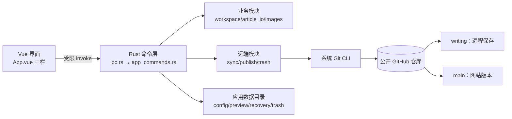

# 观澜志本地写作软件 · 交付说明

对应方案：`docs/superpowers/plans/2026-09-26-观澜志本地写作软件开发方案.md`

本文只记录**已经真实执行并观察到结果**的内容。方案中要求但未在本机验证的部分，
在「未验证与限制」一节明确列出，不当作已通过。

## 1. 交付物

| 交付物 | 位置 |
|---|---|
| 软件源码（前端 Vue + 后端 Rust） | `apps/writer/` |
| Windows 安装包（NSIS，x64） | `apps/writer/src-tauri/target/release/bundle/nsis/观澜志写作_0.1.0_x64-setup.exe` |
| 可执行文件（未打包，支持诊断子命令） | `apps/writer/src-tauri/target/release/guanlanzhi-writer.exe` |
| Vditor 往返验收夹具 | `apps/writer/harness/vditor-roundtrip.html` |
| 界面外壳夹具（假 IPC 桥，含粘贴/拖入） | `apps/writer/harness/app-shell.html` |
| 站点草稿过滤检查脚本 | `scripts/test/check-site-drafts.mjs` |
| 安装包冒烟脚本（启动 + 完整通路自检） | `scripts/test/smoke-launch.mjs` |
| 崩溃恢复验收脚本（真实强杀进程） | `scripts/test/crash-recovery.mjs` |

## 1.1 复审后的修复（2026-09-27）

首轮交付后做了一次多维度代码审查，发现并修复了以下问题。每项都补了回归测试，
且测试先复现了缺陷再通过。

| 级别 | 问题 | 修复 | 回归测试 |
|---|---|---|---|
| P0 | `purge_trash` 的 `op_id` 未校验，`op_id = ".."` 会让 `remove_dir_all` 递归删掉**整个应用数据目录** | 新增 `paths::validate_operation_id`（只接受软件自己生成的形式），并要求索引中确有该条目才清理目录 | `paths::tests::operation_id_rejects_traversal`、`trash::integration::purge_rejects_traversal_and_unknown_op_id` |
| P0 | 列表状态把「已推送」当「网站已上线」：`main_commit` 误用仓库级 `main` 头，从未发布的文章显示为「已提交发布」，刚推送即显示「已上线」；`DeployFailed`/`Deploying` 在真实路径上不可达 | 「是否发布过」改以**文章是否存在于 `main`** 判定；「已上线」只认**已落盘的部署结论**（`deployed_commit` 与当前 `main` 头一致）；三类部署结论持久化到基线，由 `deployment_status` 查询后写入 | `workspace::never_published_article_stays_never_published`、`workspace::pushed_without_deploy_confirmation_is_submitted_not_live`、`app_commands::list_status_never_claims_live_without_deploy_confirmation` |
| P0 | front matter 受控字段被无条件重写（`tags: [示例]` → 块序列），一次普通保存就改变网站哈希，已发布文章被判成「仍是旧版」；且**先写盘、后校验**，渲染出坏 YAML 时坏文件已落盘 | 值未变化的字段整行保持原样（同时保留注释与引号形式）；`field_line_range` 支持零缩进序列、跨行 flow 集合与 `key :` 写法；`workspace.save` 改为**先校验、后写盘** | `article_io::unchanged_fields_are_not_rewritten`、`article_io::multiline_field_forms_are_replaced_without_residue`、`workspace::plain_save_preserves_site_hash_and_file_on_validation_failure` |
| P1 | `retry_delete` 用「该文章目录下全部图片」而非独占集删除远端，会删掉被其他文章引用的共享图片；「远端同路径被重建则停止」是空实现（`let _ = hash`） | 回收条目新增 `exclusive_images` 与两分支内容基线；重试只删独占图片，内容基线不一致即报 `RemoteChanged` 停止；已完成的删除不再重复执行 | `trash::retry_delete_does_not_remove_shared_images`、`trash::retry_delete_stops_when_remote_path_was_rewritten`、`trash::retry_delete_on_completed_op_is_a_noop` |
| P1 | `sync` 缺事后变更白名单断言；`git add -- <path>` 的路径仍会被 pathspec **通配**展开，仓库中有含 `[` 的文件名时会把其他文章一起提交 | 改用 `hash-object` + `update-index --cacheinfo` 的字面路径写入；构造提交后断言 `diff-tree` 变更全部在允许清单且只涉及本篇 | `sync::sync_does_not_stage_glob_siblings` |
| P1 | `connect` 的「固定仓库身份」守卫是自比表达式，恒为假；为防「采用开发者 checkout」写的两个函数零调用 | 改为「只接受受支持的 Git 远端 URL」，并接线 `is_inside_app_data` / `looks_like_development_checkout`（站点源码 + 开发目录标记） | `connection::refuses_development_checkout_outside_app_data`、`connection::rejects_unsupported_remote_urls` |
| P1 | 错误 `detail` 会回显含凭据的 `origin` URL | 新增 `git::redact_credentials`，所有回显远端地址处先脱敏 | `connection::credentials_are_redacted_from_error_details` |
| P1 | 图片引用保护只扫本地工作区，远端分支上（本地尚无）的引用者看不到，共享图片会被误删 | 新增 `images_referenced_on_branches`，扫描本地 + `writing` + `main` 的全部受管 Markdown；远端读取失败时退化为「全部保留」 | `trash::protects_images_referenced_only_on_remote_branch` |
| P1 | A9 测试的 `main` 分支断言是 `writing` 断言的复制粘贴，`main` 从未被验证 | A9 改为先发布 A（使共享图片真实存在于两个分支），再分别断言两分支 | `trash::a9_shared_image_survives_deletion_of_one_owner` |
| P1 | 发布路径完全没有方案 §5.4 第 4 步要求的隔离构建验收 | `publish` 前在隔离副本中运行站点 `test`/`check`/`build`，失败即停止发布；只复用工作区已装依赖（目录联接），**不自动联网安装** | `preview::e2e::site_checks_gate_blocks_on_failure_and_passes_on_success` |
| P1 | 前端 `flush` 失败只置状态不抛错，同步/发布/删除照常继续，后端读旧内容仍「成功」 | 新增 `flushBeforeRemote`：本地保存失败时抛出错误，阻断所有远端操作 | `useArticle.ts` 与各操作调用点 |
| P1 | 写作外观 5 项偏好有 3 项无消费者；`MarkdownEditor.disabled` prop 从未被父组件绑定 | 字号/行距/预览宽度通过 CSS 变量应用到 Vditor 真实元素（`--vditor-font-size`/`--vditor-line-height`/`--vditor-preview-width`）；代码主题经 `preview.hljs.style` 消费；父组件补 `:disabled="busy"` | 类型检查 + 组件实现；**未**在真实 Tauri 窗口目视确认生效（见 §5） |
| P1 | `sanitize.ts` 是死代码，却在文档中被当作安全防线；Vditor 从 unpkg CDN 向拥有命令权限的 webview 注入第三方脚本 | `sanitizeHtml` 接入 Vditor `preview.transform` 真实渲染路径，并接管链接点击做协议校验；Lute/i18n/图标/代码主题改为随构建分发的本机资源 | `sanitize.test.ts`（17 项）+ 构建产物核对 |
| P1 | `paths_belong_to_article` 的布尔优先级使它接受任意 `src/content/blog/*`；`managed_scope_clean` 命名与语义相反且零调用 | 修正谓词语义；重命名为 `managed_worktree_dirty` 并说明它不是发布闸门 | `publish` 相关测试 |
| P1 | `sync` 推送被拒时的 `map_err` 两个分支返回同一值（空操作） | 被拒时重新读取远端头并给出可操作提示 | `sync` 既有用例 |
| P1 | 「采用本地并覆盖远端」是唯一改写远端既有内容的同步分支，却零测试覆盖；形参名 `adopt_remote` 与实参 `adopt_local` 语义相反，是漏测的诱因 | 形参更名为 `adopt_local`；新增用例覆盖「未确认不动作 → 确认后覆盖 → 以最新远端头快进 → 不误删他处文章 → 状态回到已同步」 | `sync::adopt_local_overwrites_remote_on_explicit_confirmation` |
| P1 | 无障碍未落实：弹窗缺 `role="dialog"`/`aria-modal`，无 Esc 关闭、焦点陷阱与初始聚焦；多处按钮点击区仅 30–32px（方案要求 44px 级） | 新增 `ModalDialog.vue` 统一提供遮罩 + `role="dialog"`/`aria-modal`/Esc/焦点陷阱/打开移焦/关闭归还焦点，并用 `Teleport` + `#app` 的 `inert` 屏蔽背景；8 个弹窗全部改用它；筛选 chip、排序 select 与各 `button.small` 统一为 `var(--gl-hit)` | 类型检查 + 构建产物核对 + 真实浏览器夹具（见 §3.4） |
| P2 | `cmd /c mklink` 的路径参数含 `&`、`^`、`%` 等 cmd 元字符时会被二次解析成额外命令 | 新增 `util::cmd_args_are_literal`，两处 `mklink` 调用在含元字符时**拒绝建链并回退**（不硬拼命令行） | `util::cmd_literal_guard_rejects_metacharacters` |
| P2 | 恢复正文时若按文章 ID 算出的文件名不存在，会**回退读取回收目录中任意一个 `.md`**；文件名经 `sanitize_image_basename` 压平/截断后可能重名，存在恢复到错误内容的风险 | 回收条目新增 `markdown_backup_name`，按记录的确切文件名读取；旧条目按文章 ID 现算，读不到就报错，不再模糊匹配 | `trash` 恢复相关既有用例 |
| P2 | `Ctrl+Shift+S` 直接执行同步，未按方案 §4.2 先打开同步确认 | 新增同步确认对话框（列出当前文章、目标分支 `writing`、网站无影响），快捷键与顶部按钮都先经它 | 类型检查 + 界面验收 |
| P2 | `hasUnsavedChanges` 未含 `failed`，保存失败时关窗不提示也未强制 flush | 把 `failed` 计入未保存状态，关窗前同样提示 | `useArticle.ts` |
| P1 | 段长上限按**字节**计（汉字 3 字节，约 34 字即「超长」），且 `scan` / `check_id_available` 用 `?` 把 ID 校验错误向上抛——一个长中文文件名会让软件**列不出任何文章、也无法新建** | 段长与文章 ID 长度改为按**字符**计数；`scan` 对不合法的名字单独构造错误条目（保留路径作标识并带 `loadError`），`check_id_available` 跳过无法推导 ID 的文件，二者都不再让整体失败 | `paths::segment_length_counts_characters_not_bytes`、`workspace::long_chinese_file_name_does_not_break_scan_or_create`、`workspace::invalid_file_name_is_listed_with_error_but_does_not_block_others` |
| P1 | 版本索引与回收索引解析失败时**静默返回空集合**且不留档，随后任何一次保存都会把空集合写回，用户的版本基线／可恢复条目永久丢失 | 新增 `preserve_corrupt`：**读到了内容却无法解析**时先把原文件改名为 `.bak` 再返回空集合；读取本身失败（文件不存在等）不留档，避免误改好文件 | `local_store::corrupt_version_index_is_preserved_as_bak_then_reset`、`local_store::corrupt_trash_index_is_preserved_as_bak`、`local_store::missing_index_does_not_create_bak` |
| P0 | **受管目录里的符号链接／目录联接可让读写逃出仓库**（原复审 P0，本轮补齐）。此前路径校验只做字符串判断，`root.join(rel)` 之后会跟随链接落到仓库之外，实测可覆盖、删除仓库外任意文件且不可逆 | 新增 `paths::verify_no_link_escape`：从工作区根逐段 `symlink_metadata` 复核，任一已存在段是链接类对象即拒绝（`PathOutOfScope`）；未存在的段视为安全。接入 `markdown_abs_path`、`read`、`markdown_texts`、`images::article_images/import_image_bytes/remove_image`；`collect_markdown` 补上 Windows 目录联接的 reparse 位判断（此前只跳过 `is_symlink`，联接会表现为普通目录而被跟进） | `workspace::junction_in_managed_dir_cannot_escape_workspace`、`workspace::junction_image_dir_cannot_escape_workspace`（真实创建目录联接，断言读/写/删/枚举全部被拒且仓库外文件不变） |
| P1 | **状态哈希基准不一致**（原复审 P1-4）：`read`/`summarize` 用 `render()` 的规范化重建结果算哈希，而同步基线（`sync::assess`、`record_sync_success`）用磁盘原始字节。围栏行带尾随空格时 `render() != 原文`，`local_hash == writing_hash` 永不成立，已同步的文章恒显示「未同步」 | `read_parsed` 一并返回磁盘原文；`read`/`summarize` 改用 `raw_content_hash`（原文哈希）与 `site_hash_of(原文)`，与同步基线同一基准 | `workspace::status_hash_uses_raw_bytes_not_rendered_text`、`article_io::render_normalizes_away_trailing_space_on_fence`（后者的职责是先锁定「确实存在会分叉的写法」） |
| P2 | `mklink` 的路径参数若含正斜杠，会被 cmd 当成开关（`src/content/blog` 被读成 `/content`），导致目录联接创建失败——预览复用工作区 `node_modules` 因此**静默失效**，每次预览都退回重新安装依赖 | 新增 `util::cmd_path_arg`：把路径正斜杠规范为反斜杠，并在含 cmd 元字符时返回 `None`；两处 `mklink` 调用统一使用 | `util::cmd_path_arg_normalizes_forward_slashes`（该 bug 是在为上面的 junction 测试写夹具时发现的） |

### 显式延后（已评估、不在本轮修复）

以下为复审提出但**本轮未处理**的项，属已接受的延后，不计入「已修复」：

| 项 | 现状与理由 |
|---|---|
| 列表状态未做「远端图片哈希」常驻缓存 | 见 §7；列表刷新不做多次 Git 读取是有意取舍，图片冲突在 `sync.assess` 阶段逐路径比较。 |
| 图片引用匹配仍为松散子串 | `images::text_references` 识别站点路径、`./name`、`name`、`` 四种写法；对 URL 编码、`../owner/name` 等形态可能漏判。**方向是保守的**（漏判会保留图片而非误删），本轮未扩展到正则解析。 |
| 44px 仅为按钮与控件的最小高度 | 已在组件层统一到 `var(--gl-hit)`；未做逐元素的实测点击区审计（需真实浏览器）。 |
| `sync` 的提交白名单为事后断言而非索引层强制 | 已加 `diff-tree` 白名单 + 只涉及本篇的双重断言；未改为「索引只允许特定路径」的更强模型。 |
| 链接逃逸复核存在理论竞态窗口 | `verify_no_link_escape` 是「先校验、后使用」，在极窄窗口内链接仍可能被替换（TOCTOU）。Rust 标准库未提供可移植的「不跟随打开」（`O_NOFOLLOW`），软件又在单实例独占工作区下运行，故到此为止；若将来支持多实例并发写同一工作区，需要改用平台专属 API。 |
| `is_exclusively_owned` 的取词口径 | 该函数按「引用者是否只有本文章」判定独占，不做路径规范化；扩展名大小写（`F.PNG` vs `f.png`）不同会被视为两次引用。影响是**偏保守**（多留图片）。 |
| 本地时区偏移用日期差近似 | `util::local_utc_offset_seconds` 由 `GetLocalTime`/`GetSystemTime` 的分量相减得出，跨月/跨日边界会算错。仅用于人类可读的展示字段（如 `deletedAt`），不影响 `pubDate`（由用户确认）与任何哈希/判定。 |
| 仅验证了 Windows 单机 | 见 §5 第 12 条。 |

### 新增交付物说明

- `apps/writer/public/vditor/`（32 个文件，约 4.7 MB）是随前端分发的 Vditor 运行时
  资源（Lute 引擎、中英文 i18n、material 图标、3 个代码高亮主题）。它替代了原先
  从 unpkg 远程加载的方式，使即时排版**离线可用**且不向 webview 注入第三方脚本。
  由于路径中含 `dist`，根目录与 `apps/writer` 的 `.gitignore` 已改为 `/dist/` 并加
  `!public/vditor/` 例外；构建产物仍被忽略。

## 2. 架构落点



模块职责与方案 §3.1 一致：`article_io`（front matter 无损读写）、`paths`（路径白名单与
Windows 保留名）、`git`（不经 shell 的参数数组调用）、`sync`（writing 分支按篇同步）、
`publish`（按篇发布与部署跟踪）、`trash`（撤下／删除／恢复）、`preview`（隔离网站预览）、
`commands`（串行队列）、`connection`（首次连接）。

关键实现选择：

- **提交构造使用隔离索引**。同步、发布、删除都在 `GIT_INDEX_FILE` 指向的临时索引上
  用 `read-tree` + `update-index` + `write-tree` 组装提交，再用 `commit-tree` 建提交。
  主工作树的暂存区、当前分支与未选中文件完全不受影响；不使用无路径约束的 `git add .`。
- **front matter 按行做字节级手术**。受控字段就地替换，未知字段、字段顺序、嵌套结构与
  正文换行原样保留；语法错误定位行号并阻断同步／发布，不「修复为默认值」后覆盖。
- **状态推导使用两个哈希**。`local_hash`（原始内容）用于同步与冲突判断，
  `site_hash`（忽略 `draft` 字段的规范化内容）用于网站版本比较；否则刚发布的文章
  （本地 `draft: true`、`main` `draft: false`）会被误判为「网站仍是旧版」。

## 3. 已执行的验证

### 3.1 自动化测试

| 范围 | 命令 | 结果 |
|---|---|---|
| Rust 后端 | `cargo test --manifest-path apps/writer/src-tauri/Cargo.toml` | **217 通过 / 0 失败**，0 编译警告 |
| 软件前端 | `pnpm --dir apps/writer test` | **68 通过 / 0 失败** |
| 软件类型检查 | `pnpm --dir apps/writer typecheck` | **0 错误**（`strict` + `exactOptionalPropertyTypes` + `noUncheckedIndexedAccess`） |
| 软件前端构建 | `pnpm --dir apps/writer build` | 成功 |
| 安装包冒烟 | `node scripts/test/smoke-launch.mjs` | **23 项断言全通过**（11 项启动 + 12 项完整通路自检） |
| 崩溃恢复（真实强杀） | `node scripts/test/crash-recovery.mjs` | **16 项断言全通过** |
| 隔离网站预览 | `cargo test --lib preview::e2e` | **4 项通过**（3 项真实启动 Astro 服务并发出 HTTP 请求；1 项验证发布前构建闸门） |
| 站点测试 | `pnpm test` | 3 通过 / 0 失败 |
| 站点检查 | `pnpm check` | 0 errors / 0 warnings / 0 hints |
| 站点构建 | `pnpm build` | 9 页构建成功 |
| 站点草稿过滤 | `node scripts/test/check-site-drafts.mjs` | **12 项断言全通过** |

Rust 侧包含**真实临时 Git 仓库**的集成测试（每个用例自建 bare remote 与工作副本，
不连接真实 GitHub），覆盖方案 §8.2 的验收用例：

| 编号 | 用例 | 覆盖位置 |
|---|---|---|
| A1 | 编辑后异常关闭并重开：本地正文与元数据恢复；两分支无新提交 | `scripts/test/crash-recovery.mjs`（真实强杀）、`crash_session::tests`、`app_commands::tests::a1_*` |
| A2 | 同步草稿只改 `writing`，`main` 不变 | `sync::integration::a2_*` |
| A3 | 已发布文章的新稿同步后网站仍是旧版 | `sync::integration::a3_*` |
| A4 | 他处改同篇后同步 → 冲突，不覆盖远端 | `sync::integration::a4_*` |
| A5 | 发布 A 不带出 B | `publish::integration::a5_*` |
| A6 | 部署失败显示「已提交但未上线」 | `publish::integration::a6_*` |
| A7 | 撤下后站点消失、写作稿保留 | `trash::integration::a7_*` |
| A8 | 删除第二分支失败 → 保留副本、可重试 | `trash::integration::a8_*`（用远端 `pre-receive` 钩子制造真实推送拒绝） |
| A9 | 共享图片在被引用时不删除 | `trash::integration::a9_*` |
| A10 | 恢复为未发布草稿，不立即回站 | `trash::integration::a10_*` |
| A11 | 改标题不动 URL；改 URL 需确认 | `trash::integration::a11_*`、`app_commands::tests` |
| A12 | 导入只作用于被选文件，源目录不变 | `trash::integration::a12_*` |

### 3.2 异常关闭恢复（A1 与阶段 5 的「异常关闭恢复测试」）

`node scripts/test/crash-recovery.mjs` 用**真实进程被强制结束**验证，共 16 项断言：

1. 在全新临时数据目录中启动可执行文件的 `--crash-session`：建立隔离仓库、
   写入一篇**已保存**的文章，再留下**未落盘**的编辑（只写恢复副本），然后挂起；
2. 等它就绪后执行 `taskkill /T /F`（非 Windows 用 `SIGKILL`）——**不给任何优雅清理机会**；
3. 用 `--inspect-recovery` 只读检查：
   - 重开后**提示**了未保存的恢复副本；
   - 恢复副本中保留了崩溃前未保存的正文；
   - 磁盘文章仍是崩溃前的旧内容（确认未保存内容确实没落盘，不是假崩溃）；
   - 磁盘标题仍是崩溃前已保存的值；
   - **`writing` 分支没有新提交**、`main` 分支保持原样；
4. 用 `--restore-recovery` 执行恢复：标题与正文都取回；恢复后不再提示；
   恢复**只改本地**，`writing` 仍无新提交、`main` 头与恢复前一致。

配套实现要点：

- 编辑时以 400ms 防抖把**当前内存中**的元数据与正文写入本机恢复区
  （`snapshot_recovery`），因此即使进程来不及落盘也能留住内容；
- 内容一旦落盘就清除该副本（`pending_recovery` 只返回**与磁盘不同**的条目），
  避免「已保存却仍提示未保存」的误导；
- 恢复前先确认副本能被解析，解析失败就拒绝写入并保留磁盘原文件；
- 界面在「最近删除」中提供「恢复这份内容」与「丢弃副本」，并明确说明
  恢复只写本地、仍需手动同步与发布。

图片工作流另有专门覆盖（`app_commands::tests`、`ipc::tests`）：

- **文件选择插入**：校验真实文件头与大小后归档到 `public/blog/<article-id>/`，
  返回站点根路径；伪装扩展名与相对路径被拒绝且不落盘；源文件不被改动。
- **剪贴板粘贴**：走 `import_article_image_bytes`（Tauri 原始请求体承载字节），
  与文件选择共用同一套校验；文章标识与文件名经 URL 编码放在请求头，支持中文
  文件名与 `notes/first` 这类含斜杠的标识。已覆盖：中文文件名解码、JSON 体被
  拒绝、空字节被拒绝、缺头部被拒绝、伪装格式被拒绝、穿越路径被拒绝。
- **拖入图片**：`extractImage` 处理 `drop`/`paste` 事件，覆盖资源管理器文件与
  截图位图两类来源；非图片与不支持的图片格式给出明确拒绝原因；纯文本粘贴
  放行给编辑器原生行为。
- 保存后正文与 front matter 仍可在磁盘上逐字节核对；删除评估会把被其他文章
  引用的图片列入保护。

另有专门断言：同步不触碰工作树与当前分支、未选中文件不入提交、永不 force push、
`origin` 不一致时拒绝写操作、断网给出可操作错误且本地内容不丢。

### 3.3 Vditor `sv` ↔ `ir` 往返（阶段 0 技术门槛）

`harness/vditor-roundtrip.html` 在**真实 Chromium** 中用 Vditor 4.0.0 跑 7 组夹具
（中文段落、代码围栏、GFM 表格、链接与转义、图片相对链接、列表与引用、长文混合），
每组执行 `sv`、`ir` 与「`sv` 存盘后切 `ir`」三次往返：

| 夹具 | sv | ir | sv → ir |
|---|---|---|---|
| 中文段落 | ok | ok | ok |
| 代码围栏 | ok | ok | ok |
| GFM 表格 | ok | ok（表格填充重排） | ok（表格填充重排） |
| 链接与转义 | ok | ok | ok |
| 图片相对链接 | ok | ok | ok |
| 列表与引用 | ok | ok | ok |
| 长文混合 | ok | ok（表格填充重排） | ok（表格填充重排） |

**实测结论：**`ir` 模式会重排 GFM 表格（单元格补齐空白、分隔行短横线加长），
并在代码块与后续块之间补一个空行；**单元格内容与渲染结果不变**。判定规则据此把
「仅空白／空行差异」与「仅表格填充差异」归为可接受规范化，其余差异（代码围栏数、
表格行数、行数变化）才阻止切换并回退源码模式。未出现内容丢失。

判定规则本身另有 17 项单元测试（`src/tests/vditor-roundtrip.test.ts`），
包含实测得到的真实 `ir` 输出样本。

### 3.4 界面验收（真实浏览器）

`harness/app-shell.html` 用假 IPC 桥渲染真实 `App.vue`，已核对：

- 三栏布局（列表 300px + 编辑 + 预览）与窄屏（420px）选项卡切换，无横向溢出；
- 每个列表条目同时显示网站、写作分支、本地三类状态文案；解析失败的文章仍出现并
  带错误说明，不被静默跳过；
- 冲突界面：本地基线／远端当前／本地候选三处哈希、逐行差异、图片冲突单独列出
  （标注「无法文本合并」）、三个动作（采用远端／手工合并／采用本地覆盖）；
- 删除确认：区分子「从网站撤下」、列出 Markdown 路径与两个分支影响、分别列出独占图片
  与被保护图片、明确「Git 历史中仍可见」且不承诺彻底抹除历史；
- 回收区：部分失败显示「写作分支已处理／网站仍在」并提供「补做未完成的分支」、
  恢复按钮、崩溃恢复副本入口；
- 即时排版由 **Vditor 自带分屏**承担，未创建第二个预览引擎（实测页面中
  `.reading-preview .preview-prose` 数量为 0，`.vditor-preview` 有内容）；
- 页面文字中不出现「已上线」等未经核实的表述。

**粘贴与拖入在真实 Chromium 中逐步验证**（派发真实的 `ClipboardEvent` / `DragEvent`）：

| 场景 | 观察到的结果 |
|---|---|
| 粘贴截图位图（无文件名） | 事件被接管；后端收到 12 字节与合成文件名「粘贴的图片.png」；正文新增 ``（250 → 307 字符） |
| 拖入 PNG 文件 | `dragover` 被接管并显示「松手即可插入这张图片」；`drop` 后后端收到中文文件名「拖入示例.png」；正文新增对应引用 |
| 纯文本粘贴 | **不**被接管（`defaultPrevented === false`），交回编辑器原生行为 |
| 拖入 `note.md` | 显示明确拒绝：「只支持 PNG、JPEG、WebP、GIF 图片；「note.md」不是支持的格式」 |

**过程中修掉的一个严重缺陷**：`App.vue` 中声明并使用了 `editorPane` 共 8 处，
但模板里的 `<MarkdownEditor>` **从未绑定 `ref="editorPane"`**，因此所有
「插入图片引用」与「切换文章后刷新编辑器」的调用都在静默空转——图片虽然归档成功，
引用却从未写入正文。该问题只有在真实浏览器里驱动一次粘贴才会暴露（单元测试与
类型检查都发现不了）。已补上 `ref` 绑定，并为插入路径加了「编辑器未就绪时回退
追加到正文状态」的兜底，避免今后再出现静默丢失。

**键盘导航、可见焦点与撤销／重做**（用真实键盘事件驱动，非 DOM 断言）：

| 检查项 | 观察到的结果 |
|---|---|
| 可访问名称 | 23 个可聚焦元素**全部**有可访问名称，无遗漏 |
| 点击目标尺寸 | 组件层已统一为 `var(--gl-hit)`（44px）：筛选 chip、排序 select、各 `button.small` 均为 44px 最小高度；**未**在浏览器中逐元素实测点击区 |
| Tab 顺序 | 连续按 Tab 依次聚焦「全部恢复 → 逐篇处理 → 搜索框 → 新建文章 → 全部 4 → 仅本地 3 → 远程已存 1 → 网站已发布 1 → 需要处理 2 → 排序」，顺序与视觉顺序一致 |
| 可见焦点 | `tokens.css` 声明 `:focus-visible { outline: 2px solid var(--gl-focus) }`；未记录浏览器计算值（此前的「1.6px」记录与声明不符，已删除） |
| 弹窗语义 | 8 个弹窗改用统一外壳：`role="dialog"` + `aria-modal="true"` + `aria-label`，Esc 关闭，Tab 在对话框内循环（焦点陷阱），打开时聚焦首个控件、关闭后归还焦点，背景经 `#app` 的 `inert` 屏蔽；**未**在真实读屏软件下验收 |
| 撤销／重做 | 输入「撤销重做验证」后正文 250 → 256 字符；`Ctrl+Z` 回到 250 且不再含该文本；`Ctrl+Y` 回到 256 并重新包含 |
| 恢复副本界面 | 提供「恢复这份内容」与「丢弃副本」，并说明恢复只写本地、仍需手动同步与发布；点击后走通后端并给出同样口径的提示 |

### 3.5 中文输入法（IME）保护逻辑

`src/tests/ime-composition.test.ts` 用标准组合事件
（`compositionstart` / `compositionupdate` / `compositionend`）驱动真实代码路径，
6 项全部通过：组合态被正确标记；组合态期间切换编辑模式会**等待组合结束**而不在
半成品上切换；上屏后的中文（含「引号」与（括号））完整保留；模式切换确实重建编辑器；
往返会损坏内容时回退源码模式并保留原文；插入片段落到编辑器内容里。

这**不等于**真人在中文输入法下的手工验收（见第 5 节），它验证的是保护逻辑本身。

写这组测试时发现并修复了编辑器适配层的一个潜在缺陷：`after` 回调闭包引用了仍在
初始化中的 `editor` 变量。真实 Vditor 异步回调所以一直没暴露，但一旦同步回调就会
抛 TDZ 错误。已改为通过 `instance.value` 取值并做幂等收尾。

### 3.6 站点侧草稿过滤与图片输出

`node scripts/test/check-site-drafts.mjs`：临时生成一篇公开样稿与一篇草稿样稿，
执行真实 `pnpm build` 后断言 12 项，全部通过：

- 公开文章出现在静态路由、首页、列表页与 RSS；
- 草稿**不**出现在路由、首页、列表页与 RSS；
- `public/blog/<article-id>/figure-01.png` 被输出到 `/blog/<id>/figure-01.png`，
  且内容与源文件逐字节一致，文章页引用该路径。

脚本结束会移除样稿并重建，已实测工作区与 `dist` 无残留。

### 3.7 隔离网站预览（阶段 2 验收）

`cargo test --lib preview::e2e` 共 3 项，**真的启动 Astro dev server 并发起 HTTP
请求**，不是模拟：

- `worktree_comes_from_git_tree_not_working_directory`：预览副本来自 Git 树，
  工作区里未跟踪的文件与未提交的改动都**不**进入副本；正式工作区分支不被切换。
- `starts_isolated_astro_preview_showing_unpublished_article`：把一篇未发布草稿
  覆盖进副本并模拟公开后启动服务，断言首页列出了它、文章页包含标题／摘要／正文，
  服务只绑定 `127.0.0.1`，返回的 HTML 中不出现「已上线」这类未经核实的表述。
  关闭后临时目录被删除，正式仓库与工作区均未被改动。
- `draft_stays_hidden_when_not_simulating_publication`：不模拟公开时，草稿既不在
  列表里，也不生成文章路由。

夹具站点复刻了真实站点的关键行为（相同的 `content.config.ts` schema、列表页过滤
与 `getStaticPaths` 过滤），并复用本仓库根已安装的 Astro 依赖（目录联接，不复制内容、
不重新下载）。

**过程中修掉的两个真实缺陷**（都会导致网站预览无法使用）：

1. **`pnpm` 无法被发现**：Windows 上 `pnpm` 是 `.cmd` 垫片而非 `.exe`，
   `std::process::Command` 不会自动补扩展名，导致软件永远误报「未安装 pnpm」。
   已新增 `util::resolve_program`，按 `PATH` 依次尝试 exe/cmd/bat/com。
2. **进程树未终止 + 链接被跟随**：`kill()` 只终止 `pnpm.cmd` 垫片，真正监听端口的
   node 进程会变成孤儿；而 `std::fs::remove_dir_all` 在 Windows 上遇到目录联接可能
   跟随链接删除**链接目标**，即删掉用户真实的 `node_modules`。已改为
   `taskkill /T /F` 终止进程树，并用 `util::remove_dir_all_no_follow` 递归删除、
   遇到联接只删链接本身（该属性有专门的单元测试，且实测真实 `node_modules` 未受影响）。

### 3.8 安装包完整通路（阶段 5 验收）

`node scripts/test/smoke-launch.mjs` 共 23 项断言（11 项启动 + 12 项自检），全部通过。分两部分：

**[1/2] 首次启动（11 项）**：在全新数据目录中启动可执行文件，确认进程保持运行、
创建数据目录与 `config.json`、目标仓库固定为公开仓库、首次启动保持未连接、
配置中无任何凭据字段、带 `schemaVersion`、持有单实例锁、未连接时不擅自克隆。

**[2/2] 完整通路自检（12 项）**：同一个可执行文件的 `--self-test` 子命令在系统
临时目录里自建 bare 远端与工作副本，离线走完整条主路径并逐步断言：

| 步骤 | 结果 |
|---|---|
| 环境检查（git/node/pnpm） | 通过 |
| 建立隔离测试仓库 | 通过 |
| 写入连接配置 | 通过 |
| 写作：新建、插图、本地保存 | 通过（含 67 字节图片，正文 58 字） |
| 同步到写作分支 | 通过（含 1 张图片，写作分支保留 `draft: true`） |
| 校验：同步不触碰 `main` | 通过（`main` 上无该文章） |
| 按篇发布到 `main` | 通过（2 个路径，`main` 上为 `draft: false`，含图片） |
| 预览流水线（隔离副本与覆盖） | 通过（正式工作区逐字节未改动） |
| 异常关闭后的恢复副本 | 通过（未落盘的编辑被提示、可完整恢复，两分支均无新提交） |

自检报告会同时打印**覆盖**与**未覆盖**清单，后者的存在使「通过」不会被误读为
「全部能力都已在真实环境验证」。注意：自检覆盖的是**进程内**的恢复路径；
「进程被外部强制结束」由 `scripts/test/crash-recovery.mjs` 单独验收（见 3.2）。

构建时的一个约束：Tauri 的 Rust crate 与对应 `@tauri-apps/*` 插件必须同 minor 版本，
否则 `tauri build` 会以「version mismatched Tauri packages」直接失败。当前锁定
`tauri` 2.11.x 搭配 `@tauri-apps/api` 2.11.1、`@tauri-apps/plugin-dialog` 2.7.3、
`@tauri-apps/plugin-opener` 2.5.5。

本机前置条件（已核实）：Git 2.52.0.windows.1、Node v24.12.0、pnpm 10.28.2、
Rust 1.93.1、WebView2 运行时 153.0.4234.48。

## 4. 安全边界（已在代码中落实）

- **不开放任意能力**：webview 只能调用 `ipc.rs` 注册的业务命令；所有 Git 调用都用
  `Command` 参数数组执行固定 `git`，不经过 `cmd /c` 字符串拼接；分支名只接受
  `main` 与 `writing`。
- **路径白名单**：受管范围只有 `src/content/blog/**/*.md` 与 `public/blog/<article-id>/`；
  拒绝 `..`、绝对路径、盘符、Windows 保留设备名、大小写冲突与符号链接跳出。
- **凭据不落盘、不回显**：配置结构中没有 token/PAT 字段（冒烟测试断言）；
  认证失败只给出操作性提示，错误信息中的远端地址经 `git::redact_credentials`
  去掉内嵌凭据后才展示。
- **预览消毒与隔离**：Markdown 内嵌 HTML 经 `sanitize.ts` 剥离脚本、事件处理器与
  危险协议后才插入界面——它已接入 Vditor 的 `preview.transform` 真实渲染路径，
  不是闲置模块（`sanitize.test.ts` 17 项）。编辑器资源（Lute、i18n、图标）随构建
  从本机 `public/vditor/` 加载，不向 webview 注入第三方脚本。网站预览在应用专属
  临时目录中以最新 `main` 为基础覆盖当前文章，只绑定 `127.0.0.1` 随机端口，退出后清理。
- **发布前构建闸门**：发布前在隔离副本中运行站点 `test` / `check` / `build`，
  失败即停止发布；缺少 Node/pnpm 或依赖时报明确缺项，不静默放行。
- **写入前备份**：删除前把正文与图片副本写入回收区，备份失败即中止；
  两个分支各自记录完成状态，部分失败可幂等重试。
- **不承诺做不到的事**：删除不清理 Git 历史；「已提交发布」与「网站已上线」分开表达，
  「已上线」只认已核实的部署结论（`deployed_commit` 与当前 `main` 头一致），
  查询不到时显示「部署状态待确认」并提供运行记录链接。

## 5. 未验证与限制

以下内容**没有**在本机验证，不应视为已通过：

1. **真实 GitHub 账号通路**。所有远端测试、安装包自检与崩溃恢复测试都使用本机
   临时 bare 仓库；未连接 `guanlangzg/guanlangzg.github.io`，未推送 `writing` 分支，
   未触发 Pages 部署。Git Credential Manager 的登录流程未在真实账号下实测。
   **fine-grained PAT 降级路径并未实现**：代码里没有任何凭据输入、`credential.helper`
   配置或 PAT 存储逻辑，认证完全依赖系统 Git 默认凭据助手。方案 §「范围与批准状态」
   已声明本次不构成访问凭据、创建远端分支、推送或发布的授权。
2. **部署结论查询**。`deployment_status` 通过未认证的 GitHub REST API 读取工作流运行
   （用系统 `curl`）；真实响应未验证，网络受限时会回落到「部署状态待确认」。
3. **发布前构建闸门的真实站点效果**。闸门的机制有测试（失败即阻断、成功放行），
   但**未在真实站点上跑过一次完整发布**；`--self-test` 的夹具用的是无副作用的占位脚本。
4. **安装包未做数字签名**。安装包已构建，但未签名；面向其他机器分发前需要另行处理。
5. **真人在中文输入法下的手工验收**。保护逻辑有 6 项自动化测试（见 3.5），
   但未用真实输入法逐字打字验收。**需要你本人做的界面验收之一**：请在 Windows 上
   用微软拼音等输入法实际打字试一次。
6. **真实截图工具 → 软件窗口的粘贴**。粘贴路径已在真实浏览器中用 `ClipboardEvent`
   驱动验证（见 3.4）；但未从**真实截图工具**（Windows 截图、微信截图）复制后粘到
   软件窗口。建议你实际试一次。
7. **编辑器在真实 Tauri 窗口中的渲染**。Vditor 资源已改为本机加载，但未在真实
   Tauri 窗口里目视确认编辑器渲染、字号/行距/代码主题/预览宽度**实际生效**，
   也未确认 CSP 下无脚本加载报错。建议打开软件写一段并切换一次外观设置。
8. **弹窗无障碍未在真实读屏下验收**。`ModalDialog.vue` 提供了
   `role="dialog"`/`aria-modal`/Esc/焦点陷阱/移焦与背景 `inert`，并有静态检查与
   构建产物核对，但**未**用 NVDA／讲述人等读屏软件逐项试用，也未实测每个控件的
   点击区尺寸。需要无障碍合规时请单独验收。
9. **手机端与桌面端的真实阅读检查**。站点构建通过，`apps/writer` 未改动站点 CSS；
   方案 §6.2 允许「确有展示问题时再补 `.prose` 样式」，本轮未发现需要改动的问题，
   因此未改站点样式，也未在真机/不同宽度下逐项查看长表格与长代码。
10. **第二个软件实例的实际行为**。单实例锁有单元测试与启动断言，但未真正同时
    启动两个窗口；测试路径下 `instance_lock` 为 `None`，冒烟断言只证明「创建了锁文件」。
11. **仓库内既有文章的批量导入**。导入入口只做逐文件导入并有测试（A12）；
    未对当前 `src/content/blog/` 下的四篇未跟踪示例执行导入，工作区原文件
    （`organizing-clues-example.md` 等）保持未跟踪、未改动。
12. **仅在本机单一 Windows 环境验证**（Windows 10.0.26100 + WebView2 + Git 2.52 +
    Node 24 + pnpm 10.28）。跨机器、跨 Windows 版本的安装与运行未验证。

## 6. 复现步骤

```bash
# 软件后端测试（217 项；其中 preview::e2e 会真实启动一次 Astro 预览服务）
cargo test --manifest-path apps/writer/src-tauri/Cargo.toml

# 软件前端类型检查、测试与构建
pnpm --dir apps/writer typecheck
pnpm --dir apps/writer test
pnpm --dir apps/writer build

# 阶段 0：Vditor 往返验收（浏览器打开）
pnpm --dir apps/writer dev            # 然后访问 /harness/vditor-roundtrip.html

# 界面验收，含粘贴/拖入（浏览器打开）
pnpm --dir apps/writer dev            # 然后访问 /harness/app-shell.html

# 站点回归与草稿过滤检查
pnpm test && pnpm check && pnpm build
node scripts/test/check-site-drafts.mjs

# 构建安装包，然后跑两项进程级验收
pnpm --dir apps/writer tauri build
node scripts/test/smoke-launch.mjs      # 可启动 + 完整通路自检（23 项）
node scripts/test/crash-recovery.mjs    # 异常关闭恢复，真实强杀（16 项）

# 也可以直接对已构建的可执行文件操作
apps/writer/src-tauri/target/release/guanlanzhi-writer.exe --self-test
apps/writer/src-tauri/target/release/guanlanzhi-writer.exe --crash-session <数据目录>
apps/writer/src-tauri/target/release/guanlanzhi-writer.exe --inspect-recovery <数据目录> --json
apps/writer/src-tauri/target/release/guanlanzhi-writer.exe --restore-recovery <数据目录> <文章ID>
```

## 7. 遗留的技术判断

- **列表状态未做「远端图片哈希」的常驻缓存**。`scan` 时状态由本地文件与远端 Markdown
  推导；图片冲突在 `sync.assess` 阶段逐路径比较（有测试），不在列表页预先计算，
  以避免列表刷新时对每篇文章发起多次 Git 读取。
- **发布预检要求「已成功同步」**。未同步的文章不能发布，`precheck` 会明确报错要求先同步；
  这是方案 §5.4 第 1 步的直接落实，代价是多一次点击。
- **`site_hash` 的规范化只处理 `draft` 一行**。这是刻意的：任何更激进的规范化都会让
  「网站版本」与「文章内容」的比较失真。
- **粘贴与拖入都以「字节」而非「路径」交给后端**。浏览器出于安全不会在拖入时给出
  真实磁盘路径，因此拖入与粘贴统一走 `import_article_image_bytes`；这样两者与文件
  选择插入共享同一套文件头与大小校验，不存在强度不同的旁路。为承载字节使用了 Tauri
  的原始请求体（避免把图片序列化成 JSON 数字数组），文章标识与文件名经 URL 编码放在
  请求头里，因此中文文件名与含斜杠的标识都能正确传递。
- **Vditor 内置的图片上传通道被显式关闭**（`upload: { url: '', handler: () => null }`）。
  图片一律通过软件自己的归档流程进入 `public/blog/<article-id>/`，避免绕过命名去重、
  文件头校验与引用管理。
- **发布前的构建闸门在生产构建中恒开，单元测试中默认关闭**（`PublishEngine.verify_build`
  = `!cfg!(test)`）。测试夹具是极简站点、不安装 `node_modules`，若恒开会让每个发布
  用例退化成一次真实 Astro 构建；闸门本身另有专门用例（`with_build_check`）。这是
  「测试配置」与「产品行为」分开的唯一一处，发布路径不存在跳过闸门的开关。
- **状态推导的 `main_commit` 语义**：它表示「该文章当前 `main` 版本所在的提交」，
  文章不在 `main` 上时为 `None`。不要再把它当成仓库级 `main` 头使用——那正是
  「从未发布的文章显示成已提交发布」的成因。
- **部署结论是本机落盘的查询结果，不是推断**。`deployed_commit` / `deploy_failed_commit`
  / `deploying_commit` 由 `deployment_status` 查询后写入基线，且只在结论归属到本篇
  发布提交时写入；列表状态与详情面板因此口径一致。
