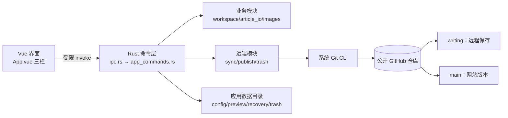

# 观澜志本地写作软件 · 交付说明

对应方案：`docs/superpowers/plans/2026-09-26-观澜志本地写作软件开发方案.md`
本轮施工单：`docs/观澜志本地写作软件-二阶段开发文档.md`

本文只记录**已经真实执行并观察到结果**的内容。方案中要求但未在本机验证的部分，
在「未验证与限制」一节明确列出，不当作已通过。

## 1. 交付物

> 位于 `apps/writer/` 的 Rust 构建产物**不进仓库目录**：仓库根的
> `.cargo/config.toml` 把 `target-dir` 指向 `../.build/writer-target`
> （即 `D:\PROJECT_ZZZZZZZZZ\.build\writer-target`）。单次构建可达数 GB，
> 放在博客目录里会拖慢备份、杀毒扫描与全盘搜索。
> 验收脚本不写死该路径，而是由 `apps/writer/scripts/lib/writer-exe.mjs`
> 向 `cargo metadata` 询问 `target_directory`。

| 交付物 | 位置 |
|---|---|
| 软件源码（前端 Vue + 后端 Rust） | `apps/writer/` |
| 站点 ↔ 软件契约（受管目录、字段、闸门、分支） | `apps/writer/站点契约.md` |
| 二阶段施工单 | `docs/观澜志本地写作软件-二阶段开发文档.md` |
| Windows 安装包（NSIS，x64） | `../.build/writer-target/release/bundle/nsis/观澜志写作_0.1.0_x64-setup.exe` |
| 可执行文件（未打包，支持诊断子命令） | `../.build/writer-target/release/guanlanzhi-writer.exe` |
| 界面外壳夹具（假 IPC 桥，含粘贴/拖入） | `apps/writer/harness/app-shell.html` |
| 站点正文样式快照生成器（构建期，零依赖） | `apps/writer/scripts/build-preview-css.mjs` |
| 站点正文样式受控快照（生成物，进仓库） | `apps/writer/src/styles/preview-article.css` |
| 软件验收脚本（安装包冒烟 / 崩溃恢复） | `apps/writer/scripts/` |
| 站点草稿过滤与图片输出检查（跨界守约） | `scripts/test/check-site-drafts.mjs` |
| 契约断言测试 | `tests/writer-contract.test.ts` |

## 1.1 复审后的修复（2026-09-27）

首轮交付后做了一次多维度代码审查，发现并修复了以下问题。每项都补了回归测试，
且测试先复现了缺陷再通过。

| 级别 | 问题 | 修复 | 回归测试 |
|---|---|---|---|
| P0 | `purge_trash` 的 `op_id` 未校验，`op_id = ".."` 会让 `remove_dir_all` 递归删掉**整个应用数据目录** | 新增 `paths::validate_operation_id`（只接受软件自己生成的形式），并要求索引中确有该条目才清理目录 | `paths::tests::operation_id_rejects_traversal`、`trash::integration::purge_rejects_traversal_and_unknown_op_id` |
| P0 | 列表状态把「已推送」当「网站已上线」：`main_commit` 误用仓库级 `main` 头，从未发布的文章显示为「已提交发布」，刚推送即显示「已上线」；`DeployFailed`/`Deploying` 在真实路径上不可达 | 「是否发布过」改以**文章是否存在于 `main`** 判定；「已上线」只认**已落盘的部署结论**（`deployed_commit` 与当前 `main` 头一致）；三类部署结论持久化到基线，由 `deployment_status` 查询后写入 | `workspace::never_published_article_stays_never_published`、`workspace::pushed_without_deploy_confirmation_is_submitted_not_live`、`app_commands::list_status_never_claims_live_without_deploy_confirmation` |
| P0 | front matter 受控字段被无条件重写（`tags: [示例]` → 块序列），一次普通保存就改变网站哈希，已发布文章被判成「仍是旧版」；且**先写盘、后校验**，渲染出坏 YAML 时坏文件已落盘 | 值未变化的字段整行保持原样（同时保留注释与引号形式）；`field_line_range` 支持零缩进序列、跨行 flow 集合与 `key :` 写法；`workspace.save` 改为**先校验、后写盘** | `article_io::unchanged_fields_are_not_rewritten`、`article_io::multiline_field_forms_are_replaced_without_residue`、`workspace::plain_save_preserves_site_hash_and_file_on_validation_failure` |
| P1 | `retry_delete` 用「该文章目录下全部图片」而非独占集删除远端，会删掉被其他文章引用的共享图片；「远端同路径被重建则停止」是空实现（`let _ = hash`） | 回收条目新增 `exclusive_images` 与两分支内容基线；重试只删独占图片，内容基线不一致即报 `RemoteChanged` 停止；已完成的删除不再重复执行 | `trash::retry_delete_does_not_remove_shared_images`、`trash::retry_delete_stops_when_remote_path_was_rewritten`、`trash::retry_delete_on_completed_op_is_a_noop` |
| P1 | `sync` 缺事后变更白名单断言；`git add -- <path>` 的路径仍会被 pathspec **通配**展开，仓库中有含 `[` 的文件名时会把其他文章一起提交 | 改用 `hash-object` + `update-index --cacheinfo` 的字面路径写入；构造提交后断言 `diff-tree` 变更全部在允许清单且只涉及本篇 | `sync::sync_does_not_stage_glob_siblings` |
| P1 | `connect` 的「固定仓库身份」守卫是自比表达式，恒为假；为防「采用开发者 checkout」写的两个函数零调用 | 改为「只接受受支持的 Git 远端 URL」，并接线 `is_inside_app_data` / `looks_like_development_checkout`（站点源码 + 开发目录标记） | `connection::refuses_development_checkout_outside_app_data`、`connection::rejects_unsupported_remote_urls` |
| P1 | 错误 `detail` 会回显含凭据的 `origin` URL | 新增 `git::redact_credentials`，所有回显远端地址处先脱敏 | `connection::credentials_are_redacted_from_error_details` |
| P1 | 图片引用保护只扫本地工作区，远端分支上（本地尚无）的引用者看不到，共享图片会被误删 | 新增 `images_referenced_on_branches`，扫描本地 + `writing` + `main` 的全部受管 Markdown；远端读取失败时退化为「全部保留」 | `trash::protects_images_referenced_only_on_remote_branch` |
| P1 | A9 测试的 `main` 分支断言是 `writing` 断言的复制粘贴，`main` 从未被验证 | A9 改为先发布 A（使共享图片真实存在于两个分支），再分别断言两分支 | `trash::a9_shared_image_survives_deletion_of_one_owner` |
| P1 | 发布路径完全没有方案 §5.4 第 4 步要求的隔离构建验收 | `publish` 前在隔离副本中运行站点 `test`/`check`/`build`，失败即停止发布；只复用工作区已装依赖（目录联接），**不自动联网安装** | `preview::e2e::site_checks_gate_blocks_on_failure_and_passes_on_success` |
| P1 | 前端 `flush` 失败只置状态不抛错，同步/发布/删除照常继续，后端读旧内容仍「成功」 | 新增 `flushBeforeRemote`：本地保存失败时抛出错误，阻断所有远端操作 | `useArticle.ts` 与各操作调用点 |
| P1 | 写作外观 5 项偏好有 3 项无消费者；`MarkdownEditor.disabled` prop 从未被父组件绑定 | 字号/行距/预览宽度通过 CSS 变量应用到 Vditor 真实元素（`--vditor-font-size`/`--vditor-line-height`/`--vditor-preview-width`）；代码主题经 `preview.hljs.style` 消费；父组件补 `:disabled="busy"` | 类型检查 + 组件实现；**未**在真实 Tauri 窗口目视确认生效（见 §5） |
| P1 | `sanitize.ts` 是死代码，却在文档中被当作安全防线；Vditor 从 unpkg CDN 向拥有命令权限的 webview 注入第三方脚本 | `sanitizeHtml` 接入 Vditor `preview.transform` 真实渲染路径，并接管链接点击做协议校验；Lute/i18n/图标/代码主题改为随构建分发的本机资源 | `sanitize.test.ts`（17 项）+ 构建产物核对 |
| P1 | `paths_belong_to_article` 的布尔优先级使它接受任意 `src/content/blog/*`；`managed_scope_clean` 命名与语义相反且零调用 | 修正谓词语义；重命名为 `managed_worktree_dirty` 并说明它不是发布闸门 | `publish` 相关测试 |
| P1 | `sync` 推送被拒时的 `map_err` 两个分支返回同一值（空操作） | 被拒时重新读取远端头并给出可操作提示 | `sync` 既有用例 |
| P1 | 「采用本地并覆盖远端」是唯一改写远端既有内容的同步分支，却零测试覆盖；形参名 `adopt_remote` 与实参 `adopt_local` 语义相反，是漏测的诱因 | 形参更名为 `adopt_local`；新增用例覆盖「未确认不动作 → 确认后覆盖 → 以最新远端头快进 → 不误删他处文章 → 状态回到已同步」 | `sync::adopt_local_overwrites_remote_on_explicit_confirmation` |
| P1 | 无障碍未落实：弹窗缺 `role="dialog"`/`aria-modal`，无 Esc 关闭、焦点陷阱与初始聚焦；多处按钮点击区仅 30–32px（方案要求 44px 级） | 新增 `ModalDialog.vue` 统一提供遮罩 + `role="dialog"`/`aria-modal`/Esc/焦点陷阱/打开移焦/关闭归还焦点，并用 `Teleport` + `#app` 的 `inert` 屏蔽背景；8 个弹窗全部改用它；筛选 chip、排序 select 与各 `button.small` 统一为 `var(--gl-hit)` | 类型检查 + 构建产物核对 + 真实浏览器夹具（见 §3.4） |
| P2 | `cmd /c mklink` 的路径参数含 `&`、`^`、`%` 等 cmd 元字符时会被二次解析成额外命令 | 新增 `util::cmd_args_are_literal`，两处 `mklink` 调用在含元字符时**拒绝建链并回退**（不硬拼命令行） | `util::cmd_literal_guard_rejects_metacharacters` |
| P2 | 恢复正文时若按文章 ID 算出的文件名不存在，会**回退读取回收目录中任意一个 `.md`**；文件名经 `sanitize_image_basename` 压平/截断后可能重名，存在恢复到错误内容的风险 | 回收条目新增 `markdown_backup_name`，按记录的确切文件名读取；旧条目按文章 ID 现算，读不到就报错，不再模糊匹配 | `trash` 恢复相关既有用例 |
| P2 | `Ctrl+Shift+S` 直接执行同步，未按方案 §4.2 先打开同步确认 | 新增同步确认对话框（列出当前文章、目标分支 `writing`、网站无影响），快捷键与顶部按钮都先经它 | 类型检查 + 界面验收 |
| P2 | `hasUnsavedChanges` 未含 `failed`，保存失败时关窗不提示也未强制 flush | 把 `failed` 计入未保存状态，关窗前同样提示 | `useArticle.ts` |
| P1 | 段长上限按**字节**计（汉字 3 字节，约 34 字即「超长」），且 `scan` / `check_id_available` 用 `?` 把 ID 校验错误向上抛——一个长中文文件名会让软件**列不出任何文章、也无法新建** | 段长与文章 ID 长度改为按**字符**计数；`scan` 对不合法的名字单独构造错误条目（保留路径作标识并带 `loadError`），`check_id_available` 跳过无法推导 ID 的文件，二者都不再让整体失败 | `paths::segment_length_counts_characters_not_bytes`、`workspace::long_chinese_file_name_does_not_break_scan_or_create`、`workspace::invalid_file_name_is_listed_with_error_but_does_not_block_others` |
| P1 | 版本索引与回收索引解析失败时**静默返回空集合**且不留档，随后任何一次保存都会把空集合写回，用户的版本基线／可恢复条目永久丢失 | 新增 `preserve_corrupt`：**读到了内容却无法解析**时先把原文件改名为 `.bak` 再返回空集合；读取本身失败（文件不存在等）不留档，避免误改好文件 | `local_store::corrupt_version_index_is_preserved_as_bak_then_reset`、`local_store::corrupt_trash_index_is_preserved_as_bak`、`local_store::missing_index_does_not_create_bak` |
| P0 | **受管目录里的符号链接／目录联接可让读写逃出仓库**（原复审 P0，本轮补齐）。此前路径校验只做字符串判断，`root.join(rel)` 之后会跟随链接落到仓库之外，实测可覆盖、删除仓库外任意文件且不可逆 | 新增 `paths::verify_no_link_escape`：从工作区根逐段 `symlink_metadata` 复核，任一已存在段是链接类对象即拒绝（`PathOutOfScope`）；未存在的段视为安全。接入 `markdown_abs_path`、`read`、`markdown_texts`、`images::article_images/import_image_bytes/remove_image`；`collect_markdown` 补上 Windows 目录联接的 reparse 位判断（此前只跳过 `is_symlink`，联接会表现为普通目录而被跟进） | `workspace::junction_in_managed_dir_cannot_escape_workspace`、`workspace::junction_image_dir_cannot_escape_workspace`（真实创建目录联接，断言读/写/删/枚举全部被拒且仓库外文件不变） |
| P1 | **状态哈希基准不一致**（原复审 P1-4）：`read`/`summarize` 用 `render()` 的规范化重建结果算哈希，而同步基线（`sync::assess`、`record_sync_success`）用磁盘原始字节。围栏行带尾随空格时 `render() != 原文`，`local_hash == writing_hash` 永不成立，已同步的文章恒显示「未同步」 | `read_parsed` 一并返回磁盘原文；`read`/`summarize` 改用 `raw_content_hash`（原文哈希）与 `site_hash_of(原文)`，与同步基线同一基准 | `workspace::status_hash_uses_raw_bytes_not_rendered_text`、`article_io::render_normalizes_away_trailing_space_on_fence`（后者的职责是先锁定「确实存在会分叉的写法」） |
| P2 | `mklink` 的路径参数若含正斜杠，会被 cmd 当成开关（`src/content/blog` 被读成 `/content`），导致目录联接创建失败——预览复用工作区 `node_modules` 因此**静默失效**，每次预览都退回重新安装依赖 | 新增 `util::cmd_path_arg`：把路径正斜杠规范为反斜杠，并在含 cmd 元字符时返回 `None`；两处 `mklink` 调用统一使用 | `util::cmd_path_arg_normalizes_forward_slashes`（该 bug 是在为上面的 junction 测试写夹具时发现的） |

### 显式延后（已评估、不在本轮修复）

以下为复审提出但**本轮未处理**的项，属已接受的延后，不计入「已修复」：

| 项 | 现状与理由 |
|---|---|
| 列表状态未做「远端图片哈希」常驻缓存 | 见 §7；列表刷新不做多次 Git 读取是有意取舍，图片冲突在 `sync.assess` 阶段逐路径比较。 |
| 图片引用匹配仍为松散子串 | `images::text_references` 识别站点路径、`./name`、`name`、`` 四种写法；对 URL 编码、`../owner/name` 等形态可能漏判。**方向是保守的**（漏判会保留图片而非误删），本轮未扩展到正则解析。 |
| 44px 仅为按钮与控件的最小高度 | 已在组件层统一到 `var(--gl-hit)`；未做逐元素的实测点击区审计（需真实浏览器）。 |
| `sync` 的提交白名单为事后断言而非索引层强制 | 已加 `diff-tree` 白名单 + 只涉及本篇的双重断言；未改为「索引只允许特定路径」的更强模型。 |
| 链接逃逸复核存在理论竞态窗口 | `verify_no_link_escape` 是「先校验、后使用」，在极窄窗口内链接仍可能被替换（TOCTOU）。Rust 标准库未提供可移植的「不跟随打开」（`O_NOFOLLOW`），软件又在单实例独占工作区下运行，故到此为止；若将来支持多实例并发写同一工作区，需要改用平台专属 API。 |
| `is_exclusively_owned` 的取词口径 | 该函数按「引用者是否只有本文章」判定独占，不做路径规范化；扩展名大小写（`F.PNG` vs `f.png`）不同会被视为两次引用。影响是**偏保守**（多留图片）。 |
| 本地时区偏移用日期差近似 | `util::local_utc_offset_seconds` 由 `GetLocalTime`/`GetSystemTime` 的分量相减得出，跨月/跨日边界会算错。仅用于人类可读的展示字段（如 `deletedAt`），不影响 `pubDate`（由用户确认）与任何哈希/判定。 |
| 仅验证了 Windows 单机 | 见 §5 第 12 条。 |

### 新增交付物说明

- ~~`apps/writer/public/vditor/`（32 个文件，约 4.7 MB）~~ **已随二阶段退役移除**。
  该目录是第一轮为「让即时排版离线可用、不向 webview 注入第三方脚本」而随前端分发的
  Vditor 运行时资源（Lute 引擎、i18n、图标、代码高亮主题），二阶段换成 CodeMirror 6
  后连同 Vditor 依赖、适配层与 `.gitignore` 例外一并删除（见 §1.3）。当前软件不再需要
  任何前端运行时第三方资源；即时预览由 `marked` + `sanitizeHtml` + 站点样式快照承担。

## 1.2 仓库边界（2026-09-27 整理）

软件与站点留在**同一个仓库**，但边界按「谁依赖谁」划清：

- **依赖是单向的**：软件依赖站点（受管目录、front matter 字段、发布闸门要跑的
  三个脚本、部署分支），站点不依赖软件。软件在运行时也不直接依赖这个仓库——首次
  连接会在应用数据目录里建自己的 clone，Rust 集成测试则用自建的 bare 远端与夹具
  站点骨架，都不读真实站点。
- **软件的验收脚本收进它自己的包**（`apps/writer/scripts/`），通过
  `pnpm --dir apps/writer smoke|crash-recovery` 运行；它们只依赖软件自己的产物。
  跨界的 `check-site-drafts.mjs` 留在站点根 `scripts/test/`。
- **契约变成机器检查**（`tests/writer-contract.test.ts` + `apps/writer/站点契约.md`）。
  这是本次整理的主要收益：此前契约只存在于代码与记忆里，软件写 A 目录、站点读 B
  目录这类漂移不会在提交前暴露，只会在用户点「发布」时炸掉或静默写坏站点。
- **构建产物移出仓库**（`.cargo/config.toml` 的 `target-dir`）。整理前
  `apps/writer/src-tauri/target/` 有 8.6 GB 落在博客目录内，影响备份、杀毒扫描与
  全盘搜索。
- **仍是两处独立安装**（各自 `pnpm-lock.yaml` 与 `node_modules`，无
  `pnpm-workspace.yaml`）。这是有意的：两边技术栈与工具链不同，合并成一个 workspace
  会把软件的依赖图绑进站点构建，收益不抵复杂度。约束是命令不可混用，已在契约文档写明。

## 1.3 二阶段施工的修复（2026-09-27）

按 `docs/观澜志本地写作软件-二阶段开发文档.md` 施工。阶段一修可用性（黑窗 + 卡顿），
阶段二把编辑内核换成 CodeMirror 6 并复刻外壳。每项都补了回归测试；**需要变异验证的
守护测试**（§4.3）逐个制造过漂移确认能变红，见 §3.9。

### 阶段一 · 可用性

| 项 | 问题（施工前的实际状态） | 修复 | 回归测试 |
|---|---|---|---|
| A3 黑窗 | release 主程序是 GUI 子系统，但它启动的每个控制台程序（git、node、pnpm 的 `.cmd` 垫片、cmd、taskkill、curl）都会各自分配控制台窗口。全仓库**没有**一处设置 `creation_flags` | 新增 `util::hide_console` 作为**唯一**的标志入口，并让 `program_command` 默认带上 `CREATE_NO_WINDOW`；把 `git.rs`（2 处）、`publish.rs`、`testkit.rs`（2 处）、`trash.rs`、`app_commands.rs`（curl）、`workspace.rs`（mklink）的直接 `Command::new` 全部改走该入口 | `util::program_command_applies_the_console_flag`、`util::production_code_creates_processes_only_through_program_command`（扫描生产源码的裸 `Command::new`）、`util::hidden_console_keeps_pipes_working`（确认标志不影响管道，`publish` 的 stdin 传 blob 依赖它） |
| D14 CLI 输出 | release 是 GUI 子系统，从 cmd/PowerShell 运行时 `println!` 被丢弃，`--self-test` 看不到输出 | 新增 `util::attach_parent_console`（`AttachConsole(ATTACH_PARENT_PROCESS)` + 重新绑定 stdout/stderr 到 `CONOUT$`），在 `lib.rs` 的任何输出之前调用；退出前显式 flush；双击启动时 `AttachConsole` 失败即静默返回，不影响 GUI | 未做自动化断言（需真实终端）；**待 release 实测**，见 §5 |
| A4 启动不跑外部命令 | `connection_status` 同步调用 `check_toolchain()`，在首帧前列出 `git`/`node`/`pnpm --version`，既是启动黑窗来源也让首帧等待进程创建 | 新增 `ToolchainState`（`unchecked` / `checkFailed` / `checked`＋时间戳）并落盘；`Connector::status()` 只读缓存，**不启动任何进程**；真实探测移到用户显式触发的 `toolchain_report` | `app_commands::toolchain_check_is_explicit_and_recorded`（启动时为 `unchecked`，显式触发后才有结论且被记录） |
| A5 状态不撒谎 | Rust `RemoteSync`/`SiteState` 与前端类型**没有「未核对」态**；`remote_snapshots` 用 `.ok().flatten()` 把 fetch 失败、分支不存在、单篇读取失败混成同一个 `None`，界面据此把未知显示成「已同步」或「从未发布」 | 新增 `CheckState`（`unverified`/`absent`/`present`）与 `BranchCheck`（含原因、依据的远端头、核对时间），两分支**分别**表达；`derive_status` 任何分支未核对时一律给 `Unverified`，绝不显示肯定结论；`remote_snapshots` **不再发起网络请求**，只读「仍可证明有效」的缓存（先读到当前跟踪头、且与记录的头一致才复用） | `workspace::failed_remote_check_never_claims_a_conclusion`（含「只有一支失败时另一支结论照常生效」）、`workspace::status_derivation_covers_all_site_states`（新增未核对态断言） |
| A5 保存离线 | 每次自动保存成功后 `await refreshList()` → `list_articles` → 两分支 `git fetch` + 逐篇 `git show` + 全工作区扫描，全部跑在保存路径上 | `flush()` 移除 `refreshList()`，改用保存返回值更新**本地字段**并替换列表对应项；本地原文变化后把两个分支的结论**降级为待核对**（不照搬 `workspace.save` 返回的默认快照——那不是远端事实） | `remote-state.test.ts`：保存只写本地、打开文章只核对一次、本地变化后旧结论失效 |
| A5 迟到结果 | 异步核对后切篇文章，旧请求返回会写进新文章的状态 | 请求序号 + 本地哈希双重校验，任一不过**整条丢弃**；同篇文章去重，并发核对串行且只保留最后排队的一篇 | `remote-state.test.ts`：迟到结果不串篇、哈希不一致整条丢弃、连续切换只执行首尾两次 |
| A5 超时 | 断网时 `git fetch` 可能长时间挂住，界面停在「正在核对」且无法取消 | 新增 `git::git_with_timeout`（轮询 `try_wait`，超时先 kill 再取管道）与 `SyncEngine::fetch_with_timeout` / `markdown_at_with_timeout`；超时转成「未核对 ＋ 原因」，**不复用旧结论** | `remote-state.test.ts` 覆盖未核对态的界面文案 |
| A2 阻塞命令 | 38 个业务命令是同步 `fn`，联网、逐篇 Git 读取与预览依赖安装都直接跑在 IPC 调用路径上 | 把经定位的 15 个重型命令改为 `async fn` + `tauri::async_runtime::spawn_blocking`（闭包要求 `Send + 'static`，故移入拥有型 `AppHandle` 后在闭包内取状态）；纯内存/短命令保持同步；不跨 `await` 持有锁，保留按篇写互斥。**顺带修掉一处真实竞态**：`check_article_remote` 原先分两次读盘（本地哈希与站点哈希），两次之间落盘的新内容会让结论自相矛盾，已改为一次读盘复用同一份字节 | `app_commands::remote_check_hash_matches_disk_content_at_check_time`、`stale_check_outcome_is_detectably_outdated_after_a_save`、`concurrent_save_and_check_produce_a_consistent_snapshot`（后台线程用与产品一致的原子写持续换版，断言结论必须与它携带的本地版本对上）、`older_remote_conclusion_never_labels_newer_local_content_as_synced` |
| A6 预览依赖 | `start_site_preview` 内部可能执行 `pnpm install --frozen-lockfile`，在命令里阻塞数分钟 | 拆开：缺依赖时启动**直接返回可操作状态**（新错误码 `preview-dependencies-missing`）并清理临时副本，不再隐式安装；新增独立任务机制（真实 `taskId`、状态 `Missing/Preparing/Ready/Failed`、重复请求返回**同一 taskId**、超时按进程树终止、线程创建失败返回 `Failed` 而非假的「进行中」）；现有 Astro 真服务入口保留。前端已接线（可查询状态 + 触发准备） | `preview::tests::missing_dependencies_report_actionable_error_without_installing`、`existing_dependencies_are_accepted_without_installing`、`repeated_prepare_requests_share_one_real_task`、`prepare_task_failure_surfaces_actionable_status`、`prepare_task_timeout_terminates_child_and_reports_status`、`real_install_failure_is_reported_with_actionable_detail`、`real_install_marks_workspace_dependencies_ready` |

### 阶段二 · 编辑器界面复刻

| 项 | 内容 |
|---|---|
| §3.5 技术栈 | 引入并**锁定精确版本**：`tailwindcss@4.3.3` + `@tailwindcss/vite@4.3.3`、`reka-ui@2.10.5`、`@lucide/vue@1.48.0`。**先验证了与现有 `vite@8.3.1` / `vue@3.5.43` 兼容**（`pnpm build` 通过，Tailwind v4 的 `@tailwindcss/vite` 插件与 Vite 8 正常工作），故未回退 Tailwind 3、未升级站点。`src/styles/theme.css` 把观澜志色板映射为 `@theme` 变量并补齐控件高度（40/36/28px）、圆角（6/8/12px）、间距（4px 基准）与字号（12/14/16/18px）；外壳深色模式只作用于软件自身，站点预览始终浅色。**深色模式的接线见 §1.4**（首轮只声明了 `:root.dark` 变量，没有任何触发点，等于死代码） |
| §3.2 编辑内核 | 退役 Vditor，换成 CodeMirror 6（`@codemirror/*` 共 14 个包，精确版本）。GFM 语言支持含表格、任务列表、删除线、围栏代码；代码块语言按需静态导入（不用会把几十种语言打进产物的 `language-data` 整包）。**新约束「打开→不编辑→保存保持磁盘原文」已落实并有测试**：CodeMirror 6 在 `EditorState` 内部**固定**用 `\n` 存行（`Text.of` 不接收分隔符，`lineSeparator` 只影响变更解析），实测 `\r\n` 会被静默抹掉，因此在编辑器**外面**透明转换进出两侧的换行风格 |
| §3.2 三条入口 | 菜单栏（文件/编辑/格式/插入/样式/帮助）、`/` 斜杠命令（基础/常用/编辑/样式分组，↑↓ Enter Esc 导航）、右键菜单（文本格式/标题/插入/导出）**共用同一批命令函数**（`@/editor/commands`），不会三条路径行为分叉。**没有图标工具栏**（照搬参考实现 v2.1.0 的形态）。站点未配置公式渲染，故不提供会误导用户的「插入公式」。**首轮此条不成立**：右键菜单的「导出 Markdown 文件」只 `emit` 而无人监听、右键「插入」分组缺超链接，均已修（§1.4） |
| §3.1 布局 | 可折叠三段式（文章列表 280px｜编辑｜预览）。用 **flex 而非 grid**：面板数量随折叠与抽屉开关变化，固定 `grid-template-columns` 一旦对不上子元素数量，多出来的面板会被挤进隐式行、把状态栏顶到页面中间（这正是首次浏览器验收抓到的问题，见 §3.10）。底部状态栏显示本地/写作分支/网站三处状态、**上次远端核对时间**、光标行列与字数；未知态显示「待核对」而非肯定结论。视图与侧栏折叠状态持久化见 §1.4（首轮未实现，刷新即丢）；文章列表选中态样式见 §1.4（施工单点名的缺口，首轮仍缺） |
| §3.3 即时预览 | 站点正文样式快照由构建期脚本从仓库自己的 `src/styles/global.css` 抽取（零依赖、感知注释/字符串/括号的规则切分器，**按选择器白名单过滤**而非字符串替换），生成物 `preview-article.css` 进仓库并有防漂移测试。**不在运行时读取工作区 CSS**（工作区可变，`@import`/`url()`/逃逸选择器会引入资源加载与样式注入风险，而 webview 具备本地命令权限）。预览渲染在**同源 iframe** 里，宽度精确可控（桌面 760px / 手机 375px）：站点样式的媒体查询按视口判断，用容器模拟会在窗口变窄时误触发移动端规则。分层为 `marked`(GFM) → `sanitizeHtml` → 隔离容器＋样式快照；净化失败退化为纯文本转义，不注入原始 HTML |
| §3.4 样式抽屉 | 默认显示站点原貌（`.prose` 16px / 行高 2.05 / 段距 21px）。可选字号（含「站点 16px」）、行距（含「站点 2.05」）、段间距缩放与预览列宽；覆盖**显式写到 `.prose` 自身**（快照里它自己声明了这两个属性，只靠继承会被覆盖）。用 `null` 表示「跟随站点基准」，与「用户显式选了 16px」区分开。明示「仅影响软件预览，不改变网站文章」；不提供站点没有的可发布主题色、自定义 CSS、字体系列与代码主题切换。**首轮字号与行距实际不生效**（覆盖规则用了跨 iframe 边界失效的 CSS 变量），已修，见 §1.4 |
| §3.6 Vditor 退役 | 依赖、`public/vditor/`（33 个文件约 4.9 MB）、Vditor 适配层（`MarkdownEditor.ts`/`.vue`）、专属夹具与 `.gitignore` 例外全部移除。删除的**测试已有替代断言**，见下 |

### Vditor 退役后的测试替代（不得静默减少覆盖）

| 删除的测试/夹具 | 替代断言 | 覆盖变化 |
|---|---|---|
| `src/tests/vditor-roundtrip.test.ts`（17 项：`sv↔ir` 往返判定） | 往返判定随 Vditor 退役而**语义失效**（CodeMirror 不重排 Markdown）。改为 `src/tests/editor-codemirror.test.ts` 的「打开→不编辑→保存保持磁盘原文」（含 CRLF 与围栏尾随空格的样本）、「只移动光标不改内容」、「撤销回初始状态仍逐字节相同」、「切文章整体替换且不触发 dirty」 | 覆盖**增强**：旧断言只保证「规范化可接受」，新断言直接锁定磁盘字节不变 |
| `src/tests/ime-composition.test.ts`（6 项，基于 `useVditor` 替身） | 重写为驱动真实 CodeMirror 组件：组合期间**不向外发送变化**（避免未上屏的拼音触发自动保存）、组合结束一次性交还上屏结果、中文内容完整保留、连续两次组合互不干扰、非组合态普通输入照常发送 | 覆盖**增强**：旧版验证替身的状态标记，新版验证真实组件的向外发送行为 |
| `harness/vditor-roundtrip.html` | 无替代（该夹具只为已退役的往返判定服务）；`harness/app-shell.html` 保留并新增 `check_article_remote` 处理器与 `lastRemoteCheckId` 读取口 | 真实浏览器界面验收路径不变 |


## 1.4 二阶段独立复审后的修复（2026-09-28）

对 §1.3 的成果做了一次独立复审：重跑全部自动化回归，并**逐项核对「声明」与「消费点」**。
阶段一的三条主线（黑窗收口、保存离线、状态不撒谎）与阶段二的内核替换、预览快照防漂移
经复核**成立**；但阶段二的若干外壳交互存在「声明了但没人消费」的缺陷——类型检查与
既有测试全绿，因为它们只验证声明存在，不验证是否被使用。

| 级别 | 问题（复审前的实际状态） | 修复 | 回归测试 |
|---|---|---|---|
| P1 | **样式抽屉的字号与行距完全不生效**。覆盖规则写成 `var(--preview-font-size, 16px)`，而唯一定义该变量的 `usePreviewStyles().cssVariables` **零消费者**（从未被渲染）。CSS 自定义属性不跨 iframe 文档边界，`var()` 静默退化成 fallback，因此字号永远 16px、行距永远 2.05 | 覆盖值改为**字面量**直接写进 iframe 文档的覆盖规则（`InstantPreview.overrideCss`）；删除零消费者的 `cssVariables`，避免同类缺陷再次以「声明存在」的形态留在代码里 | `preview-style-drawer.test.ts`（5 项）：字号/行距随取值变化、未选时回落站点基准、**覆盖规则不得含 `var(--preview-*`**、段间距缩放仍在 |
| P1 | 右键菜单「导出 Markdown 文件」**只 emit 无人监听**，点击无任何反应 | 新增后端 `export_article`（只读工作区、只写用户选定路径），前端经「另存为」对话框接线；同时把该入口加进「文件」菜单，导出前先 `flush` 保证导出的是磁盘上与界面一致的内容 | Rust `app_commands::export_writes_disk_bytes_and_refuses_managed_targets`（磁盘原文逐字节一致、拒绝相对路径/受管工作区/应用数据目录目标、不改动工作区）；`shell-wiring.test.ts` 断言组件真的转发事件且外壳真的接住 |
| P2 | 右键菜单「插入」分组缺超链接（手动挑了三项，与插入菜单不同源） | 改为直接复用 `INSERT_COMMANDS`（表格/代码块/超链接）再加分隔线 | `shell-wiring.test.ts`：断言分组含超链接 |
| P2 | 文章列表**选中态无样式**。`:class="{ selected }"` 绑定了却没有对应 CSS 规则，选中项与未选中视觉完全相同——这正是施工单 §3.1-2 点名要补的缺口 | 新增 `.item.selected` 规则：表面底色 + 强调色边框 + 左侧竖条，并单独覆盖 hover，避免悬停时选中态被吃掉 | `shell-wiring.test.ts`：绑定侧与规则侧同时存在、选中态**不只靠颜色**（须有竖条/边框）、渲染时类名真的带上 |
| P2 | **深色模式是死代码**。`theme.css` 声明了 `:root.dark` 变量，但全项目没有任何地方添加 `dark` 类或读取 `prefers-color-scheme`；「默认跟随系统」未实现，也没有偏好入口 | 新增 `useShellTheme`：默认 `system` 跟随系统并在系统配色变化时重新应用，`light`/`dark` 显式钉死；挂到 `:root`；偏好设置里新增「软件配色」选择。`main.ts` 在挂载前先应用一次，避免首帧闪白底 | `shell-wiring.test.ts`：`resolveDark` 三态、真的写到根元素、**system 模式下系统切换会重新应用**（有监听者）；Rust `shell_theme_defaults_to_system_and_clamps_unknown_values` |
| P2 | 视图模式与侧栏折叠**未持久化**（施工单 §3.1-5 要求），刷新即丢 | 新增 `useShellLayout`，把两者写入本机 `localStorage`；取值非法时退回默认值 | `shell-wiring.test.ts`：写入后可恢复、存储被写坏时退回默认值 |
| P2 | 新增 `shellTheme` 偏好字段若用普通 `serde` 反序列化，**旧版 `config.json` 会解析失败**，而 `load_config` 会把解析失败判为「配置损坏」并重置整份配置，用户的仓库地址与其他偏好一并丢失 | 字段加 `#[serde(default)]`，缺失时回落 `system`；未知取值在 `clamp` 里也退回 `system` | Rust `config_without_shell_theme_still_loads_other_preferences`：抹掉字段后其余偏好原样保留、不产生 `.bak` |

**过程中暴露的一个环境问题（非本次改动引入）**：`tauri` crate 的 build script 把旧
`src-tauri/target` 的**绝对路径**烘焙进了缓存输出（`memory.md` 已记录 target 目录搬迁的
这个后遗症）。此前它一直命中缓存未暴露；本轮改 `capabilities/default.json` 使 build
script 重新执行，报「找不到 …/src-tauri/target/…/permissions/….toml」。定向 `cargo clean -p tauri`
后恢复正常，未动 release 产物。

## 1.5 二阶段验收复审后的修复（2026-09-28）

按二阶段施工单做**验收审查**（不是再跑一遍测试）：逐个核对施工单条目与代码的真实行为，
并补了一次真实浏览器（夹具 + 1440×900 视口）的布局测量。发现的缺陷与修法如下，
每项都补了回归测试并做过变异验证（§3.13）。

### 会丢内容 / 会被打断的交互

| 级别 | 问题（复审前的实际状态） | 修复 | 回归测试 |
|---|---|---|---|
| P1 | **保存失败后切换文章会丢掉当前草稿**。`openArticle()` 先 `await flush()` 就直接读入新文章，而 `flush()` 把失败降级为界面状态（`saveState='failed'`）**不抛错**——于是上一篇未落盘的正文被整体替换，用户只看到恢复副本提示 | 与 `flushBeforeRemote` 同源：`flush()` 后若 `saveState === 'failed'` 则**抛错中断切换**，当前草稿留在编辑器里 | `remote-state.test.ts`：保存失败时 `openArticle('other')` 必须 reject 且当前文章与正文不变；另加「保存成功后仍可正常切换」 |
| P1 | **输入法组合期间切篇会打断输入**。编辑器已发 `composition` 事件，但外壳**没有监听**；组合中点击别的文章会整体替换文档 | 编辑器 `compositionstart` 立即通知外壳；外壳在组合期间**拒绝切篇**并排队，组合结束后自动打开目标文章。编辑器另在组合中**挂起**外部内容替换，组合结束再落地（丢弃属于旧文章的合成文本） | `ime-composition.test.ts`：组合中换文章时替换被挂起、结束后落到新内容且不回写旧文本；组合开始即发 `composing: true`。`shell-wiring` 断言外壳真的监听 `@composition` |
| P2 | **斜杠命令把过滤词留在正文里**。`/` 被编辑器 `preventDefault` 挡住（不进正文），但过滤词会真的写进文档且执行命令前从不清理，插入块级内容后正文里残留「表」这类垃圾 | 新增 `deleteSlashTrigger(view, query)`：只在「光标前确实是这段过滤词」时删除，不符就不动文档（不误删 `3/4`、URL）；菜单 `choose()` 先清理再执行 | 新增 `slash-command.test.ts`（真实挂载菜单、敲入过滤词、点击命令，断言文档无残留）＋ `editor-codemirror` 的纯函数用例 |

### 布局与预览

| 级别 | 问题（复审前的实际状态） | 修复 | 回归测试 |
|---|---|---|---|
| P1 | **「双屏」实际是上下堆叠，不是三段式**。`.editor-row` 是 `flex-direction: column`，编辑与预览纵向排列，与施工单 §3.1 的「列表｜编辑｜预览」不符 | 改用 reka-ui 的 `SplitterGroup direction="horizontal"` 让编辑与预览**左右并排**；外层同样用 Splitter 承担「列表｜主列」 | `shell-wiring.test.ts`：编辑／预览的 group 必须 `direction="horizontal"`，且 `.editor-row` 规则里不得出现 `flex-direction: column` |
| P1 | **面板分隔条拖动未实现**（施工单 §3.1-5 明确要求）。`reka-ui` 引进后零消费者 | 用 reka-ui 的 `SplitterGroup` / `SplitterPanel` / `SplitterResizeHandle` 实现可拖动分隔条（键盘/触屏等价交互由原语提供），**比例交给 `autoSaveId` 持久化**，不再自存一份宽度（两处各存一份会立刻不一致） | `shell-wiring.test.ts`：断言三个原语都在用、`auto-save-id` 存在、`useShellLayout` 不再含 `listWidth` |
| P1 | **改布局时把窄屏的文章列表弄丢了**。窄屏分支只剩编辑器，用户无法选文章——这是本轮改布局时自己引入的回归，靠真实浏览器测量才发现 | 窄屏保留整宽列表面板 + 折叠按钮（复用同一 `listCollapsed`），选中后可收起回到编辑／预览 | `shell-wiring.test.ts`：窄屏分支必须同时含 `<ArticleList` 与折叠按钮及其 `@click` |
| P1 | **桌面即时预览把阅读列宽当成 iframe 视口**。预览 iframe 只有 760px，落进站点 `@media (max-width: 780px)`，误触发平板规则（`.shell`/`.article` 内边距都变），与真实桌面页不同；而且 1000px 的视口在 543px 的预览列里会被裁掉右侧 | 桌面视口改用 `.shell` 上限 1000px（`.article` 自己在里面收到 760px 阅读列），并按容器宽度**等比缩放整张页面**（缩放不改变媒体查询语义，只缩小显示）；容器更宽时居中显示。缩放测量不依赖 `ResizeObserver`（rAF 不触发的宿主里它一次都不回调，会把预览缩成一个点），以 `ResizeObserver` 为主、`window.resize` 与重绘前补测兜底 | `shell-wiring.test.ts`：断言用 `shellMaxWidthPx` 且不再把 `articleMaxWidthPx` 当视口。**浏览器实测**：iframe 内视口 1000px、文章列 760px、`padding-top: 78px`（桌面值），`canvasOverflowX: 0`（不裁切） |
| P2 | **预览模式里文章只占约 140px 高**。元数据表单（366px）在预览模式下仍占位，整宽预览只剩一条缝 | 元数据表单只在编辑视图渲染（`v-if="draftMeta && showEditor"`），预览模式下让文章预览占满整列 | 浏览器实测：预览模式下列表仍可达、预览面板 608px、画布 514px |
| P2 | 预览**不跟随发布日期与标签**。监听的字段只到标题与摘要，只改日期/标签时预览显示旧值 | 监听列表补齐 `pubDate` 与 `tags` | `preview-style-drawer.test.ts`：改日期与标签后头部更新、只改标签也重绘 |
| P2 | 即时预览**允许远端图片**（`img-src` 含任意 http/https），与「预览完全离线」的承诺不符，文章里的远端图片会在写「看预览」时发起第三方请求 | 图片协议收紧到与 CSP `img-src` 一致：站内相对路径、`data:`/`blob:`/`asset:` 与 **127.0.0.1/localhost**；`srcset` 改为**逐个候选**校验（原实现把整串当一个 URL，首候选安全就整条放行）；拒绝 `127.0.0.1@evil.invalid` 这类 userinfo 伪装 | `sanitize.test.ts`：远端图片被移除、本机与 data 图保留、userinfo 伪装被拒、`srcset` 混合候选整条丢弃 |
| P2 | 旧的 `previewWidth` 偏好仍有可操作控件，但预览宽度早已由样式抽屉决定——调了没反应 | 移除该控件（取值仍保留在本机配置里、不被改写），并在偏好面板说明预览样式在「样式」抽屉 | 类型检查 + 浏览器实测（偏好面板不再出现该滑块） |

### 后端边界

| 级别 | 问题（复审前的实际状态） | 修复 | 回归测试 |
|---|---|---|---|
| P1 | **同源但没有开发标记的既有仓库会被当成工作区**。原判据是「像不像开发目录」（要同时有站点源码与 `.superpowers`/`.zcode` 标记），个人 clone 与 linked worktree 都不满足，于是被接受——软件随后会在那里同步/发布/删除，直接推真实远端、删真实文件 | 判据改为「**是不是软件自己建的**」：只有应用数据目录内的仓库被采用，其余位置一律要求交给软件新建（提示区分「开发检出」与「同源但不是工作副本」） | `connection.rs`：新增 `refuses_same_origin_checkout_outside_app_data`（无标记 clone + linked worktree 都拒绝）、`adopts_existing_repository_inside_app_data`（应用数据目录内仍采用） |
| P2 | **导出目标的字符串前缀检查挡不住链接**。`fs::write` 会跟随符号链接/目录联接，用户可选一个指向工作区的链接作为导出目标，绕过「不在工作区内」的判断 | 新增 `util::verify_output_path_not_link`：从最近的存在祖先逐段 `symlink_metadata`，任一段是链接类对象即拒绝（`PathOutOfScope`） | `app_commands::export_refuses_target_reaching_managed_areas_through_a_link`：用**真实 Windows 目录联接**（无需管理员权限）构造逃逸，断言被拒且受管文件逐字节未变 |
| P2 | **远端核对可能因管道未及时读取而假超时**。`git_with_timeout` 先等子进程退出、再读 stdout/stderr；`git show` 输出超过管道缓冲（Windows 默认 64 KiB）时双方互等，终止后被误报为「核对超时」 | 改为**并发读取**管道（两条读取线程 + 超时轮询），避免死锁 | `git::git_with_timeout_drains_large_output_without_false_timeout`：4000 个已跟踪文件、输出远超管道缓冲，必须在超时内读回全部（变异验证见 §3.13） |
| P2 | `toolchain_report` 是唯一仍在 IPC 线程上跑探测的同步命令（会依次启动 git/node/pnpm 且无超时） | 与其余重型命令一致，改为 `async fn` + `run_blocking` | 既有 `toolchain_check_is_explicit_and_recorded` 语义不变 |

### 测试噪声

| 级别 | 问题 | 修复 |
|---|---|---|
| P2 | 前端测试每次运行都刷出大量 `TypeError: textRange(...).getClientRects is not a function`——jsdom 没有实现 `Range.getClientRects`，CodeMirror 做光标测量时抛错。**这不是失败，但会把真正的失败淹没** | 新增 `src/tests/setup.ts` 补 `Range.getClientRects` / `getBoundingClientRect` / `ResizeObserver`，挂到 `vitest.config.ts` 的 `setupFiles`；返回空矩形是安全下界（调用方退化为「测不到」，不伪造坐标） |

### 仍存在、本轮未处理的偏差

- **`reka-ui` 已有真实消费者**（§1.5 的分隔条），原先「零消费者」的记录作废；但既有弹窗
  仍继续用已验证的 `ModalDialog.vue`（施工单同段明确允许不替换）。
- 准备预览依赖的进程在用户关窗时不会主动终止（非本次引入）。
- 缩放预览用的是 `transform: scale()`，iframe 内文本的**实际渲染字号**因此小于站点
  16px（视觉等比缩小）。这是刻意的：视口宽度保持 1000px 才能让媒体查询与真实页面一致；
  若要求逐像素同尺寸，需把预览列本身拉到 ≥1000px 宽。

## 2. 架构落点



模块职责与方案 §3.1 一致：`article_io`（front matter 无损读写）、`paths`（路径白名单与
Windows 保留名）、`git`（不经 shell 的参数数组调用）、`sync`（writing 分支按篇同步）、
`publish`（按篇发布与部署跟踪）、`trash`（撤下／删除／恢复）、`preview`（隔离网站预览）、
`commands`（串行队列）、`connection`（首次连接）。

关键实现选择：

- **提交构造使用隔离索引**。同步、发布、删除都在 `GIT_INDEX_FILE` 指向的临时索引上
  用 `read-tree` + `update-index` + `write-tree` 组装提交，再用 `commit-tree` 建提交。
  主工作树的暂存区、当前分支与未选中文件完全不受影响；不使用无路径约束的 `git add .`。
- **front matter 按行做字节级手术**。受控字段就地替换，未知字段、字段顺序、嵌套结构与
  正文换行原样保留；语法错误定位行号并阻断同步／发布，不「修复为默认值」后覆盖。
- **状态推导使用两个哈希**。`local_hash`（原始内容）用于同步与冲突判断，
  `site_hash`（忽略 `draft` 字段的规范化内容）用于网站版本比较；否则刚发布的文章
  （本地 `draft: true`、`main` `draft: false`）会被误判为「网站仍是旧版」。

## 3. 已执行的验证

### 3.1 自动化测试

| 范围 | 命令 | 结果 |
|---|---|---|
| Rust 后端 | `cargo test --manifest-path apps/writer/src-tauri/Cargo.toml` | **244 通过 / 0 失败**（二阶段施工后 217 → 236，§1.4 复审修复后 236 → 239，§1.5 验收复审修复后 239 → 244） |
| 软件前端 | `pnpm --dir apps/writer test` | **122 通过 / 0 失败**（10 个文件；Vditor 退役后 68 → 82，§1.4 复审修复后 82 → 99，§1.5 后 99 → 122） |
| 软件类型检查 | `pnpm --dir apps/writer typecheck` | **0 错误**（`strict` + `exactOptionalPropertyTypes` + `noUncheckedIndexedAccess`） |
| 软件前端构建 | `pnpm --dir apps/writer build` | 成功（Vite 8.3.1 + Tailwind v4 插件） |
| 站点样式快照防漂移 | `pnpm --dir apps/writer test` 的 `preview-style-snapshot.test.ts` | **9 项通过**；改快照或改站点源值都会变红（变异验证见 §3.9） |
| 安装包冒烟 | `pnpm --dir apps/writer smoke` | **23 项断言全通过**（11 项启动 + 12 项完整通路自检）——**§1.5 改动后已重跑** |
| 崩溃恢复（真实强杀） | `pnpm --dir apps/writer crash-recovery` | **16 项断言全通过**——**§1.5 改动后已重跑**（含 §1.5 保护文章的切篇守卫在内，强杀恢复未退化） |
| release 构建 | `pnpm --dir apps/writer tauri build` | 成功（含 NSIS 安装包）——**§1.5 改动后已重跑** |
| CLI 诊断输出与退出码 | `guanlanzhi-writer.exe --help / --self-test / --crash-session` | 见 §3.11（D14 的实测结论） |
| 隔离网站预览 | `cargo test --lib preview::e2e` | **4 项通过**（3 项真实启动 Astro 服务并发出 HTTP 请求；1 项验证发布前构建闸门） |
| 站点测试 | `pnpm test` | **11 通过 / 0 失败**（3 项文章排序 + 8 项站点↔软件契约） |
| 站点检查 | `pnpm check` | 0 errors / 0 warnings / 0 hints（15 文件） |
| 站点构建 | `pnpm build` | 9 页构建成功 |
| 站点草稿过滤 | `node scripts/test/check-site-drafts.mjs` | **12 项断言全通过** |

`tests/writer-contract.test.ts` 的 8 项契约断言覆盖：受管目录存在、**软件写入目录 ==
站点读取目录**、front matter 字段都在 schema 里、发布闸门的三个脚本都存在、发布分支与
部署工作流一致（且写作分支未被部署监听）、tsconfig 排除 `apps`、验收脚本可从包内运行、
构建产物在仓库之外。

该文件把站点与软件之间那份**隐含契约**（受管目录、front matter 字段、发布闸门脚本、
分支名、构建产物位置）从两侧源文件里解析出来做比对。契约细节见 `apps/writer/站点契约.md`。
它经过变异验证：逐项制造漂移（如让部署工作流监听 `writing`、让软件写 A 目录而站点读
B 目录），每一项都能让测试变红；未捕获的只有「两侧尾斜杠写法差异」这类应当容忍的等价写法。

Rust 侧包含**真实临时 Git 仓库**的集成测试（每个用例自建 bare remote 与工作副本，
不连接真实 GitHub），覆盖方案 §8.2 的验收用例：

| 编号 | 用例 | 覆盖位置 |
|---|---|---|
| A1 | 编辑后异常关闭并重开：本地正文与元数据恢复；两分支无新提交 | `pnpm --dir apps/writer crash-recovery`（真实强杀）、`crash_session::tests`、`app_commands::tests::a1_*` |
| A2 | 同步草稿只改 `writing`，`main` 不变 | `sync::integration::a2_*` |
| A3 | 已发布文章的新稿同步后网站仍是旧版 | `sync::integration::a3_*` |
| A4 | 他处改同篇后同步 → 冲突，不覆盖远端 | `sync::integration::a4_*` |
| A5 | 发布 A 不带出 B | `publish::integration::a5_*` |
| A6 | 部署失败显示「已提交但未上线」 | `publish::integration::a6_*` |
| A7 | 撤下后站点消失、写作稿保留 | `trash::integration::a7_*` |
| A8 | 删除第二分支失败 → 保留副本、可重试 | `trash::integration::a8_*`（用远端 `pre-receive` 钩子制造真实推送拒绝） |
| A9 | 共享图片在被引用时不删除 | `trash::integration::a9_*` |
| A10 | 恢复为未发布草稿，不立即回站 | `trash::integration::a10_*` |
| A11 | 改标题不动 URL；改 URL 需确认 | `trash::integration::a11_*`、`app_commands::tests` |
| A12 | 导入只作用于被选文件，源目录不变 | `trash::integration::a12_*` |

### 3.2 异常关闭恢复（A1 与阶段 5 的「异常关闭恢复测试」）

`pnpm --dir apps/writer crash-recovery` 用**真实进程被强制结束**验证，共 16 项断言：

1. 在全新临时数据目录中启动可执行文件的 `--crash-session`：建立隔离仓库、
   写入一篇**已保存**的文章，再留下**未落盘**的编辑（只写恢复副本），然后挂起；
2. 等它就绪后执行 `taskkill /T /F`（非 Windows 用 `SIGKILL`）——**不给任何优雅清理机会**；
3. 用 `--inspect-recovery` 只读检查：
   - 重开后**提示**了未保存的恢复副本；
   - 恢复副本中保留了崩溃前未保存的正文；
   - 磁盘文章仍是崩溃前的旧内容（确认未保存内容确实没落盘，不是假崩溃）；
   - 磁盘标题仍是崩溃前已保存的值；
   - **`writing` 分支没有新提交**、`main` 分支保持原样；
4. 用 `--restore-recovery` 执行恢复：标题与正文都取回；恢复后不再提示；
   恢复**只改本地**，`writing` 仍无新提交、`main` 头与恢复前一致。

配套实现要点：

- 编辑时以 400ms 防抖把**当前内存中**的元数据与正文写入本机恢复区
  （`snapshot_recovery`），因此即使进程来不及落盘也能留住内容；
- 内容一旦落盘就清除该副本（`pending_recovery` 只返回**与磁盘不同**的条目），
  避免「已保存却仍提示未保存」的误导；
- 恢复前先确认副本能被解析，解析失败就拒绝写入并保留磁盘原文件；
- 界面在「最近删除」中提供「恢复这份内容」与「丢弃副本」，并明确说明
  恢复只写本地、仍需手动同步与发布。

图片工作流另有专门覆盖（`app_commands::tests`、`ipc::tests`）：

- **文件选择插入**：校验真实文件头与大小后归档到 `public/blog/<article-id>/`，
  返回站点根路径；伪装扩展名与相对路径被拒绝且不落盘；源文件不被改动。
- **剪贴板粘贴**：走 `import_article_image_bytes`（Tauri 原始请求体承载字节），
  与文件选择共用同一套校验；文章标识与文件名经 URL 编码放在请求头，支持中文
  文件名与 `notes/first` 这类含斜杠的标识。已覆盖：中文文件名解码、JSON 体被
  拒绝、空字节被拒绝、缺头部被拒绝、伪装格式被拒绝、穿越路径被拒绝。
- **拖入图片**：`extractImage` 处理 `drop`/`paste` 事件，覆盖资源管理器文件与
  截图位图两类来源；非图片与不支持的图片格式给出明确拒绝原因；纯文本粘贴
  放行给编辑器原生行为。
- 保存后正文与 front matter 仍可在磁盘上逐字节核对；删除评估会把被其他文章
  引用的图片列入保护。

另有专门断言：同步不触碰工作树与当前分支、未选中文件不入提交、永不 force push、
`origin` 不一致时拒绝写操作、断网给出可操作错误且本地内容不丢。

### 3.3 Vditor `sv` ↔ `ir` 往返（阶段 0 技术门槛，**已随 Vditor 退役**）

> 本节记录的是二阶段施工**之前**的验收结果，保留以便追溯当时的判断依据。
> `sv↔ir` 往返判定已随 Vditor 退役而语义失效，替代断言见 §1.3 的对照表。

`harness/vditor-roundtrip.html` 在**真实 Chromium** 中用 Vditor 4.0.0 跑 7 组夹具
（中文段落、代码围栏、GFM 表格、链接与转义、图片相对链接、列表与引用、长文混合），
每组执行 `sv`、`ir` 与「`sv` 存盘后切 `ir`」三次往返：

| 夹具 | sv | ir | sv → ir |
|---|---|---|---|
| 中文段落 | ok | ok | ok |
| 代码围栏 | ok | ok | ok |
| GFM 表格 | ok | ok（表格填充重排） | ok（表格填充重排） |
| 链接与转义 | ok | ok | ok |
| 图片相对链接 | ok | ok | ok |
| 列表与引用 | ok | ok | ok |
| 长文混合 | ok | ok（表格填充重排） | ok（表格填充重排） |

**实测结论：**`ir` 模式会重排 GFM 表格（单元格补齐空白、分隔行短横线加长），
并在代码块与后续块之间补一个空行；**单元格内容与渲染结果不变**。判定规则据此把
「仅空白／空行差异」与「仅表格填充差异」归为可接受规范化，其余差异（代码围栏数、
表格行数、行数变化）才阻止切换并回退源码模式。未出现内容丢失。

判定规则本身另有 17 项单元测试（`src/tests/vditor-roundtrip.test.ts`），
包含实测得到的真实 `ir` 输出样本。

### 3.4 界面验收（真实浏览器，首轮）

> 本节是**首轮**（Vditor 外壳）的验收记录。二阶段的界面验收见 §3.10。
> 两条已不成立：夹具数据变化后列表计数不再是「全部 4 / 仅本地 3」；
> 「即时排版由 Vditor 自带分屏承担」已改为 `InstantPreview.vue` 的 iframe 快照渲染。

`harness/app-shell.html` 用假 IPC 桥渲染真实 `App.vue`，已核对：

- 三栏布局（列表 300px + 编辑 + 预览）与窄屏（420px）选项卡切换，无横向溢出；
- 每个列表条目同时显示网站、写作分支、本地三类状态文案；解析失败的文章仍出现并
  带错误说明，不被静默跳过；
- 冲突界面：本地基线／远端当前／本地候选三处哈希、逐行差异、图片冲突单独列出
  （标注「无法文本合并」）、三个动作（采用远端／手工合并／采用本地覆盖）；
- 删除确认：区分子「从网站撤下」、列出 Markdown 路径与两个分支影响、分别列出独占图片
  与被保护图片、明确「Git 历史中仍可见」且不承诺彻底抹除历史；
- 回收区：部分失败显示「写作分支已处理／网站仍在」并提供「补做未完成的分支」、
  恢复按钮、崩溃恢复副本入口；
- 即时排版由 **Vditor 自带分屏**承担，未创建第二个预览引擎（实测页面中
  `.reading-preview .preview-prose` 数量为 0，`.vditor-preview` 有内容）；
- 页面文字中不出现「已上线」等未经核实的表述。

**粘贴与拖入在真实 Chromium 中逐步验证**（派发真实的 `ClipboardEvent` / `DragEvent`）：

| 场景 | 观察到的结果 |
|---|---|
| 粘贴截图位图（无文件名） | 事件被接管；后端收到 12 字节与合成文件名「粘贴的图片.png」；正文新增 ``（250 → 307 字符） |
| 拖入 PNG 文件 | `dragover` 被接管并显示「松手即可插入这张图片」；`drop` 后后端收到中文文件名「拖入示例.png」；正文新增对应引用 |
| 纯文本粘贴 | **不**被接管（`defaultPrevented === false`），交回编辑器原生行为 |
| 拖入 `note.md` | 显示明确拒绝：「只支持 PNG、JPEG、WebP、GIF 图片；「note.md」不是支持的格式」 |

**过程中修掉的一个严重缺陷**：`App.vue` 中声明并使用了 `editorPane` 共 8 处，
但模板里的 `<MarkdownEditor>` **从未绑定 `ref="editorPane"`**，因此所有
「插入图片引用」与「切换文章后刷新编辑器」的调用都在静默空转——图片虽然归档成功，
引用却从未写入正文。该问题只有在真实浏览器里驱动一次粘贴才会暴露（单元测试与
类型检查都发现不了）。已补上 `ref` 绑定，并为插入路径加了「编辑器未就绪时回退
追加到正文状态」的兜底，避免今后再出现静默丢失。

**键盘导航、可见焦点与撤销／重做**（用真实键盘事件驱动，非 DOM 断言）：

| 检查项 | 观察到的结果 |
|---|---|
| 可访问名称 | 23 个可聚焦元素**全部**有可访问名称，无遗漏 |
| 点击目标尺寸 | 组件层已统一为 `var(--gl-hit)`（44px）：筛选 chip、排序 select、各 `button.small` 均为 44px 最小高度；**未**在浏览器中逐元素实测点击区 |
| Tab 顺序 | 连续按 Tab 依次聚焦「全部恢复 → 逐篇处理 → 搜索框 → 新建文章 → 全部 4 → 仅本地 3 → 远程已存 1 → 网站已发布 1 → 需要处理 2 → 排序」，顺序与视觉顺序一致 |
| 可见焦点 | `tokens.css` 声明 `:focus-visible { outline: 2px solid var(--gl-focus) }`；未记录浏览器计算值（此前的「1.6px」记录与声明不符，已删除） |
| 弹窗语义 | 8 个弹窗改用统一外壳：`role="dialog"` + `aria-modal="true"` + `aria-label`，Esc 关闭，Tab 在对话框内循环（焦点陷阱），打开时聚焦首个控件、关闭后归还焦点，背景经 `#app` 的 `inert` 屏蔽；**未**在真实读屏软件下验收 |
| 撤销／重做 | 输入「撤销重做验证」后正文 250 → 256 字符；`Ctrl+Z` 回到 250 且不再含该文本；`Ctrl+Y` 回到 256 并重新包含 |
| 恢复副本界面 | 提供「恢复这份内容」与「丢弃副本」，并说明恢复只写本地、仍需手动同步与发布；点击后走通后端并给出同样口径的提示 |

### 3.5 中文输入法（IME）保护逻辑

> 二阶段换内核后本节已重写：见下「CodeMirror 版本」。首轮内容保留在 §3.5.1。

#### 3.5.1 首轮（Vditor 版本）

`src/tests/ime-composition.test.ts` 用标准组合事件
（`compositionstart` / `compositionupdate` / `compositionend`）驱动真实代码路径，
6 项全部通过：组合态被正确标记；组合态期间切换编辑模式会**等待组合结束**而不在
半成品上切换；上屏后的中文（含「引号」与（括号））完整保留；模式切换确实重建编辑器；
往返会损坏内容时回退源码模式并保留原文；插入片段落到编辑器内容里。

写这组测试时发现并修复了编辑器适配层的一个潜在缺陷：`after` 回调闭包引用了仍在
初始化中的 `editor` 变量。真实 Vditor 异步回调所以一直没暴露，但一旦同步回调就会
抛 TDZ 错误。已改为通过 `instance.value` 取值并做幂等收尾。

#### 3.5.2 CodeMirror 版本（本轮重写）

`src/tests/ime-composition.test.ts` 改为挂载**真实** `CodeMirrorEditor.vue` 并派发
标准组合事件，5 项全部通过：

| 检查项 | 断言 |
|---|---|
| 组合期间不发送正文变化 | `compositionstart` 后直接改 CodeMirror 文档，父组件**收不到** `update:modelValue`；`compositionend` 后才一次性交还最终文本（这正是「候选未结束不触发保存」的实现层保证） |
| 上屏内容完整保留 | 含「引号」与（括号）的中文逐字符相等，且外部发送**只有一次**（组合期间被抑制） |
| 组合态通知父组件 | 依次收到 `composing: true` → `composing: false`，界面可据此避免打断输入 |
| 连续两次组合 | 第二次内容不丢失，文档为「第一个第二个」 |
| 非组合态输入 | 照常向外发送，未被保护逻辑误吞 |

这**不等于**真人在微软拼音下的手工验收（见 §5），它验证的是保护逻辑本身。

### 3.6 站点侧草稿过滤与图片输出

`node scripts/test/check-site-drafts.mjs`：临时生成一篇公开样稿与一篇草稿样稿，
执行真实 `pnpm build` 后断言 12 项，全部通过：

- 公开文章出现在静态路由、首页、列表页与 RSS；
- 草稿**不**出现在路由、首页、列表页与 RSS；
- `public/blog/<article-id>/figure-01.png` 被输出到 `/blog/<id>/figure-01.png`，
  且内容与源文件逐字节一致，文章页引用该路径。

脚本结束会移除样稿并重建，已实测工作区与 `dist` 无残留。

### 3.7 隔离网站预览（阶段 2 验收）

`cargo test --lib preview::e2e` 共 3 项，**真的启动 Astro dev server 并发起 HTTP
请求**，不是模拟：

- `worktree_comes_from_git_tree_not_working_directory`：预览副本来自 Git 树，
  工作区里未跟踪的文件与未提交的改动都**不**进入副本；正式工作区分支不被切换。
- `starts_isolated_astro_preview_showing_unpublished_article`：把一篇未发布草稿
  覆盖进副本并模拟公开后启动服务，断言首页列出了它、文章页包含标题／摘要／正文，
  服务只绑定 `127.0.0.1`，返回的 HTML 中不出现「已上线」这类未经核实的表述。
  关闭后临时目录被删除，正式仓库与工作区均未被改动。
- `draft_stays_hidden_when_not_simulating_publication`：不模拟公开时，草稿既不在
  列表里，也不生成文章路由。

夹具站点复刻了真实站点的关键行为（相同的 `content.config.ts` schema、列表页过滤
与 `getStaticPaths` 过滤），并复用本仓库根已安装的 Astro 依赖（目录联接，不复制内容、
不重新下载）。

**过程中修掉的两个真实缺陷**（都会导致网站预览无法使用）：

1. **`pnpm` 无法被发现**：Windows 上 `pnpm` 是 `.cmd` 垫片而非 `.exe`，
   `std::process::Command` 不会自动补扩展名，导致软件永远误报「未安装 pnpm」。
   已新增 `util::resolve_program`，按 `PATH` 依次尝试 exe/cmd/bat/com。
2. **进程树未终止 + 链接被跟随**：`kill()` 只终止 `pnpm.cmd` 垫片，真正监听端口的
   node 进程会变成孤儿；而 `std::fs::remove_dir_all` 在 Windows 上遇到目录联接可能
   跟随链接删除**链接目标**，即删掉用户真实的 `node_modules`。已改为
   `taskkill /T /F` 终止进程树，并用 `util::remove_dir_all_no_follow` 递归删除、
   遇到联接只删链接本身（该属性有专门的单元测试，且实测真实 `node_modules` 未受影响）。

### 3.8 安装包完整通路（阶段 5 验收）

`pnpm --dir apps/writer smoke` 共 23 项断言（11 项启动 + 12 项自检），全部通过。分两部分：

**[1/2] 首次启动（11 项）**：在全新数据目录中启动可执行文件，确认进程保持运行、
创建数据目录与 `config.json`、目标仓库固定为公开仓库、首次启动保持未连接、
配置中无任何凭据字段、带 `schemaVersion`、持有单实例锁、未连接时不擅自克隆。

**[2/2] 完整通路自检（12 项）**：同一个可执行文件的 `--self-test` 子命令在系统
临时目录里自建 bare 远端与工作副本，离线走完整条主路径并逐步断言：

| 步骤 | 结果 |
|---|---|
| 环境检查（git/node/pnpm） | 通过 |
| 建立隔离测试仓库 | 通过 |
| 写入连接配置 | 通过 |
| 写作：新建、插图、本地保存 | 通过（含 67 字节图片，正文 58 字） |
| 同步到写作分支 | 通过（含 1 张图片，写作分支保留 `draft: true`） |
| 校验：同步不触碰 `main` | 通过（`main` 上无该文章） |
| 按篇发布到 `main` | 通过（2 个路径，`main` 上为 `draft: false`，含图片） |
| 预览流水线（隔离副本与覆盖） | 通过（正式工作区逐字节未改动） |
| 异常关闭后的恢复副本 | 通过（未落盘的编辑被提示、可完整恢复，两分支均无新提交） |

自检报告会同时打印**覆盖**与**未覆盖**清单，后者的存在使「通过」不会被误读为
「全部能力都已在真实环境验证」。注意：自检覆盖的是**进程内**的恢复路径；
「进程被外部强制结束」由 `pnpm --dir apps/writer crash-recovery` 单独验收（见 3.2）。

构建时的一个约束：Tauri 的 Rust crate 与对应 `@tauri-apps/*` 插件必须同 minor 版本，
否则 `tauri build` 会以「version mismatched Tauri packages」直接失败。当前锁定
`tauri` 2.11.x 搭配 `@tauri-apps/api` 2.11.1、`@tauri-apps/plugin-dialog` 2.7.3、
`@tauri-apps/plugin-opener` 2.5.5。

本机前置条件（已核实）：Git 2.52.0.windows.1、Node v24.12.0、pnpm 10.28.2、
Rust 1.93.1、WebView2 运行时 153.0.4234.48。

### 3.9 守护测试的变异验证（§4.3 要求）

新增的守护测试**逐项制造漂移确认能变红**，否则「通过」可能只是断言没生效
（`memory.md` 的既有教训）。本轮的验证记录：

> **一条被变异验证推翻的测试，和修法**：`concurrent_save_and_check_produce_a_consistent_snapshot`
> 原本靠「后台线程改盘 + 4 轮核对」去撞「两次读盘之间」的微秒级窗口。把实现改回两次读盘后，
> 该用例**仍然通过**——断言实际没生效。修法不是把轮数开大（80 轮要跑 114 秒，且仍是概率事件），
> 而是把「一份字节 → 一条结论」抽成纯函数 `outcome_from_local_bytes`，新增**确定性**用例
> `outcome_is_self_consistent_for_any_local_bytes`：直接喂进任意字节断言三者同源。
> 并发用例降级为冒烟（8 轮，约 23 秒），并加了「两版都必须被观察到」的前置断言。

| 守护测试 | 制造的漂移 | 结果 |
|---|---|---|
| `util::program_command_applies_the_console_flag` | 去掉 `program_command` 里的 `hide_console` 调用 | **变红** |
| `util::production_code_creates_processes_only_through_program_command` | 在任一生产文件里加一处裸 `Command::new` | **变红**（该测试扫描生产源码，不靠人工核对） |
| `workspace::failed_remote_check_never_claims_a_conclusion` | 把 `CheckState::Unverified => SiteState::Unverified` 改成 `=> SiteState::NeverPublished`（即「未知当成从未发布」） | **变红** |
| `remote-state.test.ts`：保存只写本地 | 把 `await refreshList()` 加回 `flush()` 的成功分支 | **变红** |
| `remote-state.test.ts`：迟到结果不串篇 | 去掉 `applyRemoteCheck` 的本地哈希校验（`if (false)`） | **变红** |
| `remote-state.test.ts`：并发核对限流 | 删掉 `checkRemote` 的单槽排队分支 | **变红** |
| `editor-codemirror.test.ts`：打开→保存字节不变 | 让 `toOuter` 直接返回 `\n` 版本（丢掉 CRLF 转换） | **变红** |
| `editor-codemirror.test.ts`：切文章不触发 dirty | 去掉程序性写入的变化抑制 | **变红** |
| `preview-style-snapshot.test.ts`：样式快照未漂移 | 改快照里的任一值（`margin: 0 0 21px` → `22px`） | **变红**（失败信息打印首个差异行并提示重跑生成器） |
| `preview-style-snapshot.test.ts`：跟随站点源 | 临时改站点 `src/styles/global.css` 的 `.prose` `line-height: 2.05` → `2.1` | **变红**，精确指出「已提交快照 vs 重新生成」的差异行；改后 `git diff --stat src/styles/global.css` 为空，站点源码逐字节复原 |
| `app_commands::outcome_is_self_consistent_for_any_local_bytes` | 让「一份字节 → 一条结论」的纯函数改用另一份内容算网站哈希（模拟两次读盘不同源） | **变红**（0.00s），信息为「网站结论必须与该份字节的规范化哈希一致」 |

§1.4 复审修复新增的守护测试同样逐个制造过漂移（2026-09-28 复核）：

| 守护测试 | 制造的漂移 | 结果 |
|---|---|---|
| `preview-style-drawer.test.ts`：覆盖值是字面量 | 把覆盖规则改回 `var(--preview-font-size, …)` 形式（即复审前的错误实现） | **变红 4 项**（字号/行距/基准值/「不得含 var」四条同时失败） |
| `shell-wiring.test.ts`：选中态不只靠颜色 | 从 `.item.selected` 删掉 `box-shadow` 与 `border-color`，只留背景色 | **变红** |
| `shell-wiring.test.ts`：导出事件真的被转发与接住 | 删掉 `CodeMirrorEditor` 模板上的 `@export-markdown="emit('export-markdown')"` | **变红** |
| `shell-wiring.test.ts`：配色真的写到根元素 | 让 `applyShellTheme` 变成空操作 | **变红 2 项**（含「system 模式下系统切换会重新应用」） |
| `shell-wiring.test.ts`：视图与折叠持久化 | 把两个 `watch` 的持久化调用改成空函数 | **变红** |

§1.5 验收复审新增的守护测试同样逐个制造过漂移（2026-09-28）：

| 守护测试 | 制造的漂移 | 结果 |
|---|---|---|
| `remote-state.test.ts`：保存失败不切篇 | 把 `openArticle` 里的 `saveState === 'failed'` 守卫改成 `false && …`（即复审前的行为） | **变红 1 项** |
| `slash-command.test.ts`：菜单执行前清理过滤词 | 把 `deleteSlashTrigger(props.handle.view, query.value)` 改成永假条件 | **变红 1 项**（正文残留 `table`） |
| `preview-style-drawer.test.ts`：预览跟随日期与标签 | 从 `InstantPreview` 的 watch 列表里删掉 `props.pubDate` 与 `...props.tags` | **变红 2 项** |
| `shell-wiring.test.ts`：编辑与预览左右并排 | 把编辑／预览 group 的 `direction="horizontal"` 改成 `vertical` | **变红 2 项** |
| `connection.rs`：拒同源非受管仓库 | 把 `if !is_inside_app_data(...)` 改成 `if false && …` | **变红 2 项**（开发检出与同源 clone 两条用例同时失败） |
| `app_commands.rs`：导出不得经链接落到受管目录 | 删掉 `util::verify_output_path_not_link(&target)?` | **变红 1 项**（受管文件被改写） |
| `git.rs`：超时必须并发读管道 | 改成「先等子进程退出、再读管道」（即复审前的实现） | **变红**（28.9s 后以 `Offline` 假超时失败） |

> 一条**被自己的夹具推翻**的用例（值得记）：最初的导出逃逸测试用
> `symlink_file` 建文件符号链接，实测本机 **未开启开发者模式时创建失败**
> （`客户端没有所需的特权 (os error 1314)`），用例走 `[跳过]` 分支——**
> 打印「跳过」并通过**，等于没有守护。改用 **Windows 目录联接**（`mklink /J`，
> 无需管理员权限）后，删掉守卫立刻变红。教训是「跳过」分支必须有可见输出，
> 且要用本机真能建成的夹具类型。

### 3.10 界面验收（真实浏览器，二阶段）

用 `harness/app-shell.html`（假 IPC 桥渲染真实 `App.vue`）在 ZCode 内置浏览器
（Chromium，视口 1280×720）中驱动，实测结果：

| 检查项 | 观察到的结果 |
|---|---|
| 三段式布局 | 菜单栏 `y=0 h=60`、工作区 `y=248 h=448` 内含列表 `280px` 与编辑区、状态栏 `y=696 h=24` 恰好在 720 视口底部；`document.body.scrollHeight === 720`（无整页滚动） |
| 菜单栏 | 6 项菜单（文件/编辑/格式/插入/样式/帮助）+ 视图切换（编辑/双屏/预览）；宽度 ≥980px 时展开为完整菜单栏，**没有图标工具栏** |
| 打开文章 | 点击列表条目后 CodeMirror 挂载，`.cm-content` 内容为文章正文；元数据表单标题同步为「测试样稿：网站仍是旧版」 |
| 打开后的异步核对 | `__mockState.lastRemoteCheckId()` 为 `mock-article`，即**打开触发了一次核对** |
| 即时预览 | `.instant-preview iframe` 已创建（同源 iframe，站点样式快照渲染） |
| 状态栏语义 | 显示「本地/写作分支/网站」三处状态 + 「上次远端核对：2026-09-10 08:26」+ 光标行列 + 字数；列表里的「远端待核对」条目确实显示为待核对而非肯定结论 |
| 保存路径离线 | 在保存路径上拦截并统计 IPC 命令名，`check_article_remote` / `list_articles` 均未出现（自动化层面由 `remote-state.test.ts` 覆盖，见 §3.9） |

**过程中抓到并修掉一个真实布局缺陷**：`.workspace` 原是固定两列
`grid-template-columns: 300px 1fr`，而三段式改造后它有**三个**子元素（列表、折叠按钮、
编辑列，抽屉开启时四个）。多出来的元素被排进隐式行，把状态栏顶到页面中间（截图证据：
状态栏出现在列表第 2、3 条之间，整页可滚动）。这正是「只看 DOM 结构不看渲染结果」会漏掉
的问题。已改为 flex，并统一由 `viewMode` 决定显示哪些面板。

**环境限制（不是产品缺陷）**：本机内置浏览器的该标签页 `requestAnimationFrame` 不触发
（实测 `Promise.race` 在 1500ms 内收到 `raf-timed-out`）、`document.hasFocus()` 为
`false`，因此 Playwright 的「元素稳定」判定与 CDP 的真实鼠标/键盘输入都无法完成
（`click`/`cua.click`/`cua.type` 均超时）。上面的交互因此是通过**派发真实 DOM 事件**
驱动的，读数取自页面计算样式与几何。这一限制也意味着本轮的「点击→保存→IPC 命令」
链路未在浏览器里走通输入路径，该行为由 `remote-state.test.ts` 在组件层覆盖。

### 3.10.1 三段式与预览的几何实测（2026-09-28 §1.5 复查）

§1.5 改布局后，重新用真实浏览器（夹具 + `setViewportSize(1440×900)`）**读几何与
计算样式**核对，而不是看 DOM 是否存在：

| 检查项 | 观察到的结果 |
|---|---|
| 三栏并排 | `.workspace` 的两个子元素为 `workspace-group` + `collapse-toggle`；列表面板 `x=0 w=279`，编辑列紧随其后 |
| 编辑与预览并排 | 双屏模式下编辑面板 `x=295 w=543`、预览面板 `x=843 w=543`，`.editor-row` 的 `flex-direction` 为 `row`（**修复前是 `column`**） |
| 分隔条 | 存在 `role="separator"` 的可聚焦元素（reka-ui `SplitterResizeHandle`），比例写入 `guanlanzhi.workspaceRatio` / `guanlanzhi.editorRatio` |
| 预览视口语义 | iframe 内 `documentElement.clientWidth === 1000`，`.article` 宽 `760`、`padding-top: 78px`（**桌面值**；修复前 iframe 视口 760 会命中 `max-width:780px` 而变成 `59px`） |
| 预览缩放 | 预览列 541px 时 scale `0.541`，`canvasOverflowX === 0`（不裁切右缘）；整宽预览模式下列表可达、预览面板 608px、画布 514px |
| 无整页滚动 | `document.body.scrollHeight === 900 === window.innerHeight` |

**环境限制（同 §3.10）**：该标签页 `requestAnimationFrame` 不触发，因此
`ResizeObserver` 的回调**一次都不执行**（实测注册后 600ms 内零次回调），
真实鼠标拖动与 `/` 菜单的真实键入都跑不了，交互仍用派发真实 DOM 事件驱动。
这条限制直接导致了本轮的一个产物级缺陷（见下）。

**过程中抓到并修掉两个布局缺陷**：

1. **预览被缩成一个点**：缩放比例最初只靠 `ResizeObserver` 量容器宽度，而该回调由
   rAF 驱动——在 rAF 不触发的宿主里它从不回调，比例停在挂载瞬间的过渡宽度上
   （实测 `transform: matrix(0.02, …)`，iframe 只剩 20px 宽）。改为
   **`ResizeObserver` 为主 + `window.resize` + 挂载后补测 + 每次重绘前补测**，
   并把舞台绝对定位，避免「缩放→容器变窄→更小缩放」的反馈循环。
2. **窄屏丢列表、预览模式只剩一条缝**：改三栏时窄屏分支漏了列表面板（用户无法选
   文章），且元数据表单在预览模式下仍占 366px 高。已在窄屏保留整宽列表 + 折叠按钮，
   并让元数据表单只在编辑视图渲染。

### 3.11 CLI 诊断输出与退出码（D14 实测）

release 是 GUI 子系统，从命令行运行时标准流默认不可用。用 `AttachConsole` 把父终端
接回来后实测（`Start-Process -RedirectStandardOutput/-RedirectStandardError`，退出码由
进程对象读取）：

| 命令 | 退出码 | stdout | stderr |
|---|---|---|---|
| `--help` | 0 | 428 B（完整帮助文本） | 空 |
| `--self-test` | 0 | 2570 B（完整自检报告，含「未覆盖项」清单） | 空 |
| `--crash-session`（缺参数） | **2** | 空 | 47 B（`--crash-session 需要一个数据目录参数`） |
| `--inspect-recovery`（缺参数） | **2** | 空 | 50 B（同类提示） |

**过程中修掉一个自造缺陷**：`attach_parent_console` 起初**无条件**把 stdout/stderr
重绑到 `CONOUT$`。在重定向场景（`> out.txt`、`Start-Process -RedirectStandardOutput`、
管道）下，操作系统已经给出**有效**的标准句柄，无条件改写会让输出绕过重定向直接进控制台，
于是文件里空无一物、外部完全收不到诊断信息（正确实现应「只补上缺失的标准流」）。
修法是先 `GetStdHandle` 读现有句柄，有效则保留，只对缺失的那个接控制台。

> 注意：在**没有**重定向的场景下，从 Bash 工具的管道运行 exe 仍看不到输出（该进程组无
> 可继承的控制台）。这不是产品缺陷——真实用户在 cmd/PowerShell 里有控制台，上表即该
> 场景的等价验证。这一点已列进 §5.1 第 14 条的后续建议：请在真实 cmd 窗口里手动跑一次确认。

### 3.12 二阶段的实现偏差（需要知晓）

| 项 | 施工单要求 | 实际做法与理由 |
|---|---|---|
| 代码注释语言 | §6.7「代码注释用英文」 | 仓库既有约定是**中文约束注释**（`model.rs`/`ipc.rs`/`sync.rs` 等基线代码全部如此，且注释只解释约束、不逐行叙述），`AGENTS.md` 明确「项目已有约定优先于通用偏好」。本轮**新文件**（`editor/*`、`InstantPreview.vue`、`StyleDrawer.vue` 等）按施工单用英文；**改动既有文件**时跟随该文件原有语言，因此现在是混用状态。若要求统一，需单列一次全仓注释语言替换。 |
| `reka-ui` 的采用程度 | §3.5-3「新增菜单、抽屉与分隔面板优先使用 reka-ui 原语」 | 已引入并锁定版本；**§1.5 起分隔条由 `SplitterGroup/SplitterPanel/SplitterResizeHandle` 实现**（拖动、键盘、触屏与比例持久化都由原语提供），`reka-ui` 因此有了真实消费者，原先「无消费者」的记录作废。现有弹窗继续用已验证的 `ModalDialog.vue`（施工单同段明确「不要为了统一组件库无条件替换」）。菜单栏、斜杠命令与右键菜单仍是本轮新写的轻量组件，未引入 reka-ui。 |
| 预览依赖准备的退出清理 | §A6 未要求 | 准备任务跑在 detached 线程上，用户安装途中关窗不会主动终止 pnpm 子进程。改动前同步安装同样会遗留孤儿进程，**不是本次引入的回退**，但也未改善。需要时单列一条（涉及进程清理语义）。 |

## 4. 安全边界（已在代码中落实）

- **不开放任意能力**：webview 只能调用 `ipc.rs` 注册的业务命令；所有 Git 调用都用
  `Command` 参数数组执行固定 `git`，不经过 `cmd /c` 字符串拼接；分支名只接受
  `main` 与 `writing`。
- **路径白名单**：受管范围只有 `src/content/blog/**/*.md` 与 `public/blog/<article-id>/`；
  拒绝 `..`、绝对路径、盘符、Windows 保留设备名、大小写冲突与符号链接跳出。
  **唯一的例外是「显式选定的单文件读写」**：`import_article`（读用户选定的 Markdown）
  与 `export_article`（写用户选定的路径）都要求绝对路径，且该路径由系统文件对话框给出。
  两者都不经 shell 拼接、不接收通配符；`export_article` 额外拒绝落在受管工作区或
  应用数据目录内的目标（那是软件自己管理的状态，误覆盖不可逆），并且只读工作区、
  不触碰 Git 与任何索引。
- **凭据不落盘、不回显**：配置结构中没有 token/PAT 字段（冒烟测试断言）；
  认证失败只给出操作性提示，错误信息中的远端地址经 `git::redact_credentials`
  去掉内嵌凭据后才展示。
- **预览消毒与隔离**：Markdown 内嵌 HTML 经 `sanitize.ts` 剥离脚本、事件处理器与
  危险协议后才插入预览。渲染链路是 `marked`(GFM) → `sanitizeHtml` → 同源 iframe 里的
  站点样式受控快照；**净化失败退化为纯文本转义，不降级为注入原始 HTML**。站点样式
  快照由构建期脚本按选择器白名单从仓库自己的 `src/styles/global.css` 生成，运行时
  **不读取工作区 CSS**（避免 `@import`/`url()`/逃逸选择器带来的资源加载与样式注入）。
  网站预览在应用专属临时目录中以最新 `main` 为基础覆盖当前文章，只绑定
  `127.0.0.1` 随机端口，退出后清理。
- **发布前构建闸门**：发布前在隔离副本中运行站点 `test` / `check` / `build`，
  失败即停止发布；缺少 Node/pnpm 或依赖时报明确缺项，不静默放行。
- **写入前备份**：删除前把正文与图片副本写入回收区，备份失败即中止；
  两个分支各自记录完成状态，部分失败可幂等重试。
- **不承诺做不到的事**：删除不清理 Git 历史；「已提交发布」与「网站已上线」分开表达，
  「已上线」只认已核实的部署结论（`deployed_commit` 与当前 `main` 头一致），
  查询不到时显示「部署状态待确认」并提供运行记录链接。

## 5. 未验证与限制

以下内容**没有**在本机验证，不应视为已通过：

1. **真实 GitHub 账号通路**。所有远端测试、安装包自检与崩溃恢复测试都使用本机
   临时 bare 仓库；未连接 `guanlangzg/guanlangzg.github.io`，未推送 `writing` 分支，
   未触发 Pages 部署。Git Credential Manager 的登录流程未在真实账号下实测。
   **fine-grained PAT 降级路径并未实现**：代码里没有任何凭据输入、`credential.helper`
   配置或 PAT 存储逻辑，认证完全依赖系统 Git 默认凭据助手。方案 §「范围与批准状态」
   已声明本次不构成访问凭据、创建远端分支、推送或发布的授权。
2. **部署结论查询**。`deployment_status` 通过未认证的 GitHub REST API 读取工作流运行
   （用系统 `curl`）；真实响应未验证，网络受限时会回落到「部署状态待确认」。
3. **发布前构建闸门的真实站点效果**。闸门的机制有测试（失败即阻断、成功放行），
   但**未在真实站点上跑过一次完整发布**；`--self-test` 的夹具用的是无副作用的占位脚本。
4. **安装包未做数字签名**。安装包已构建，但未签名；面向其他机器分发前需要另行处理。
5. **真人在中文输入法下的手工验收**。保护逻辑有 5 项自动化测试（见 §3.5.2），
   但未用真实输入法逐字打字验收。**需要你本人做的界面验收之一**：请在 Windows 上
   用微软拼音等输入法实际打字试一次（换 CodeMirror 后这条更该重做一次）。
6. **真实截图工具 → 软件窗口的粘贴**。粘贴路径已在真实浏览器中用 `ClipboardEvent`
   驱动验证（见 3.4）；但未从**真实截图工具**（Windows 截图、微信截图）复制后粘到
   软件窗口。建议你实际试一次。
7. **编辑器在真实 Tauri 窗口中的渲染**。二阶段已换成 CodeMirror 6 并退役 Vditor，
   但未在真实 Tauri/WebView2 窗口中目视确认编辑器渲染、菜单栏与斜杠/右键菜单的
   实际交互、预览 iframe 的媒体查询生效，也未确认 CSP 下无脚本加载报错。
   建议打开软件写一段、并按 §3.7 清单逐项过一遍。
8. **弹窗无障碍未在真实读屏下验收**。`ModalDialog.vue` 提供了
   `role="dialog"`/`aria-modal`/Esc/焦点陷阱/移焦与背景 `inert`，并有静态检查与
   构建产物核对，但**未**用 NVDA／讲述人等读屏软件逐项试用，也未实测每个控件的
   点击区尺寸。需要无障碍合规时请单独验收。
9. **手机端与桌面端的真实阅读检查**。站点构建通过，`apps/writer` 未改动站点 CSS；
   方案 §6.2 允许「确有展示问题时再补 `.prose` 样式」，本轮未发现需要改动的问题，
   因此未改站点样式，也未在真机/不同宽度下逐项查看长表格与长代码。
10. **第二个软件实例的实际行为**。单实例锁有单元测试与启动断言，但未真正同时
    启动两个窗口；测试路径下 `instance_lock` 为 `None`，冒烟断言只证明「创建了锁文件」。
11. **仓库内既有文章的批量导入**。导入入口只做逐文件导入并有测试（A12）；
    未对当前 `src/content/blog/` 下的四篇未跟踪示例执行导入，工作区原文件
    （`organizing-clues-example.md` 等）保持未跟踪、未改动。
12. **仅在本机单一 Windows 环境验证**（Windows 10.0.26100 + WebView2 + Git 2.52 +
    Node 24 + pnpm 10.28）。跨机器、跨 Windows 版本的安装与运行未验证。

### 5.1 二阶段新增的未验证项（本轮专项）

13. **黑窗的实际消失**（施工单 A3/D14 的核心目标）。子进程标志有自动化守护测试
    （扫描生产源码 + 断言 `hide_console` 已接线），但**未在真实 release 窗口里
    目视确认**黑窗不再出现。施工单 §A8 明确要求「逐调用点核对并配合真实窗口目视确认」。
    需要你本人验收：构建 release 后打开软件，确认启动、连接测试工作区、点「网站预览」
    全程无控制台黑窗。
14. **CLI 在 cmd/PowerShell 中的输出与退出码**（施工单 §A3.4）。已用重定向实测：
    `--help`/`--self-test` 有完整输出且退出码 0，缺参数时 stderr 有提示且退出码 2
    （见 §3.11），并修掉了自造的「无条件重绑 stdout 会让重定向失效」缺陷。
    **仍未验证**的是「无重定向、真实 cmd/PowerShell 窗口里直接运行」的观感——
    建议手动跑一次 `guanlanzhi-writer.exe --self-test` 确认输出可见。
15. **性能体感与回归对照表**。施工单 §4.1 要求记录「基线 / 修复后」两列实测数据
    （打开到可输入、输入 1 分钟内子进程数与调用次数、一次保存耗时、空闲 30s CPU、
    输入延迟体感）。本轮**未测量**，因为需要真实 release 窗口与真实工作区（10 篇 /
    50 篇）环境。当前只能从代码层说明：保存路径已不再联网、`remote_snapshots`
    不再隐式 `fetch`、启动路径不再执行探测命令——但「体感是否变好」未经验证。
16. **`opt-level` 档位未调整**（A7）。施工单要求「有测量依据再改」，本轮没有
    release 基准数据，因此保持 `opt-level = "s"` 未动。
17. **预览依赖准备任务的真实 pnpm 安装路径**。任务去重、失败与超时的**状态机**有
    测试（含真实超时终止子进程），但未在真实缺依赖的预览副本上跑过一次完整
    `pnpm install` 并确认后续启动成功。
18. ~~**`reka-ui` 尚未被实际组件使用**（§3.5-3）~~ **已消项（2026-09-28 §1.5）**：
    分隔条已改用 `SplitterGroup/SplitterPanel/SplitterResizeHandle`，`reka-ui` 有了真实
    消费者；既有弹窗继续用 `ModalDialog.vue`（施工单允许不替换）。仍需注意的是
    **分隔条的拖动手感未在真实 Tauri 窗口手测**（本轮的浏览器夹具里 rAF 不触发，
    无法完成真实鼠标拖动），建议实际拖一次确认。
19. **预览与真实站点页面的逐项对照**（§3.3-7）。样式快照未漂移有测试，
    但「软件预览 vs 当前 `pnpm dev` 站点页面」的 HTML 结构、链接/图片行为、
    计算样式与截图差异**未逐项记录**。站点真服务仍是最终判据，建议实际对照一次
    （至少覆盖：标题锚点、表格、任务列表、代码围栏背景与前景色、375px 手机列宽）。
20. **深色模式未目视验收**。§1.4 已把它从「死代码」修成真正可切换（默认跟随系统，
    偏好设置里有入口，`shell-wiring.test.ts` 覆盖了三态解析、写根元素与系统切换重应用），
    但**未在真实界面上目视确认**深色下的对比度、也未验证站点预览容器在同一时刻仍为浅色。
    这一条现在是「已接线、待目视」，不再是「未实现」。
21. **导出 Markdown 与深色模式的真实窗口行为未验收**。导出走后端 `export_article` +
    系统「另存为」对话框，Rust 侧有测试（磁盘原文逐字节一致、拒绝受管目标），但
    **未在真实 Tauri 窗口里点过一次**，因此对话框默认文件名、取消路径与实际写盘位置
    只经单元测试确认。

## 6. 复现步骤

全部命令在**仓库根目录**执行。`cargo` 的构建配置也放在仓库根（`.cargo/config.toml`），
从 `apps/writer` 或 `src-tauri` 执行同样生效——`target-dir` 以配置文件所在目录为基准解析。

```bash
# 软件后端测试（244 项；其中 preview::e2e 会真实启动一次 Astro 预览服务）
cargo test --manifest-path apps/writer/src-tauri/Cargo.toml

# 软件前端类型检查、测试与构建
pnpm --dir apps/writer typecheck
pnpm --dir apps/writer test
pnpm --dir apps/writer build

# 站点正文样式快照（改过站点 CSS 后必须重跑，否则防漂移测试会失败）
pnpm --dir apps/writer build:preview-css

# 界面验收，含粘贴/拖入（浏览器打开）
pnpm --dir apps/writer dev            # 然后访问 /harness/app-shell.html

# 站点回归与草稿过滤检查
pnpm test && pnpm check && pnpm build
node scripts/test/check-site-drafts.mjs

# 构建安装包，然后跑两项进程级验收
pnpm --dir apps/writer tauri build
pnpm --dir apps/writer smoke             # 可启动 + 完整通路自检（23 项）
pnpm --dir apps/writer crash-recovery    # 异常关闭恢复，真实强杀（16 项）

# 也可以直接对已构建的可执行文件操作
../.build/writer-target/release/guanlanzhi-writer.exe --self-test
../.build/writer-target/release/guanlanzhi-writer.exe --crash-session <数据目录>
../.build/writer-target/release/guanlanzhi-writer.exe --inspect-recovery <数据目录> --json
../.build/writer-target/release/guanlanzhi-writer.exe --restore-recovery <数据目录> <文章ID>
```

## 7. 遗留的技术判断

- **列表状态未做「远端图片哈希」的常驻缓存**。`scan` 时状态由本地文件与远端 Markdown
  推导；图片冲突在 `sync.assess` 阶段逐路径比较（有测试），不在列表页预先计算，
  以避免列表刷新时对每篇文章发起多次 Git 读取。
- **发布预检要求「已成功同步」**。未同步的文章不能发布，`precheck` 会明确报错要求先同步；
  这是方案 §5.4 第 1 步的直接落实，代价是多一次点击。
- **`site_hash` 的规范化只处理 `draft` 一行**。这是刻意的：任何更激进的规范化都会让
  「网站版本」与「文章内容」的比较失真。
- **粘贴与拖入都以「字节」而非「路径」交给后端**。浏览器出于安全不会在拖入时给出
  真实磁盘路径，因此拖入与粘贴统一走 `import_article_image_bytes`；这样两者与文件
  选择插入共享同一套文件头与大小校验，不存在强度不同的旁路。为承载字节使用了 Tauri
  的原始请求体（避免把图片序列化成 JSON 数字数组），文章标识与文件名经 URL 编码放在
  请求头里，因此中文文件名与含斜杠的标识都能正确传递。
- **图片一律通过软件自己的归档流程进入 `public/blog/<article-id>/`**，避免绕过命名去重、
  文件头校验与引用管理。（首轮是关闭 Vditor 的内置上传通道来达成这一点，二阶段退役
  Vditor 后该约束由编辑器不再具备上传能力自然满足。）
- **发布前的构建闸门在生产构建中恒开，单元测试中默认关闭**（`PublishEngine.verify_build`
  = `!cfg!(test)`）。测试夹具是极简站点、不安装 `node_modules`，若恒开会让每个发布
  用例退化成一次真实 Astro 构建；闸门本身另有专门用例（`with_build_check`）。这是
  「测试配置」与「产品行为」分开的唯一一处，发布路径不存在跳过闸门的开关。
- **状态推导的 `main_commit` 语义**：它表示「该文章当前 `main` 版本所在的提交」，
  文章不在 `main` 上时为 `None`。不要再把它当成仓库级 `main` 头使用——那正是
  「从未发布的文章显示成已提交发布」的成因。
- **部署结论是本机落盘的查询结果，不是推断**。`deployed_commit` / `deploy_failed_commit`
  / `deploying_commit` 由 `deployment_status` 查询后写入基线，且只在结论归属到本篇
  发布提交时写入；列表状态与详情面板因此口径一致。
